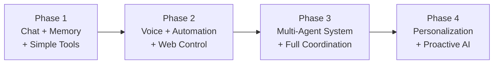
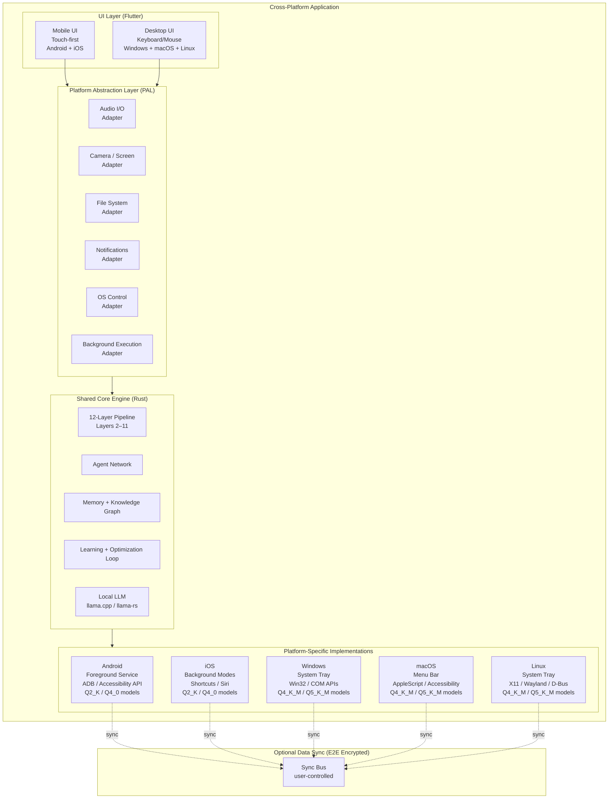
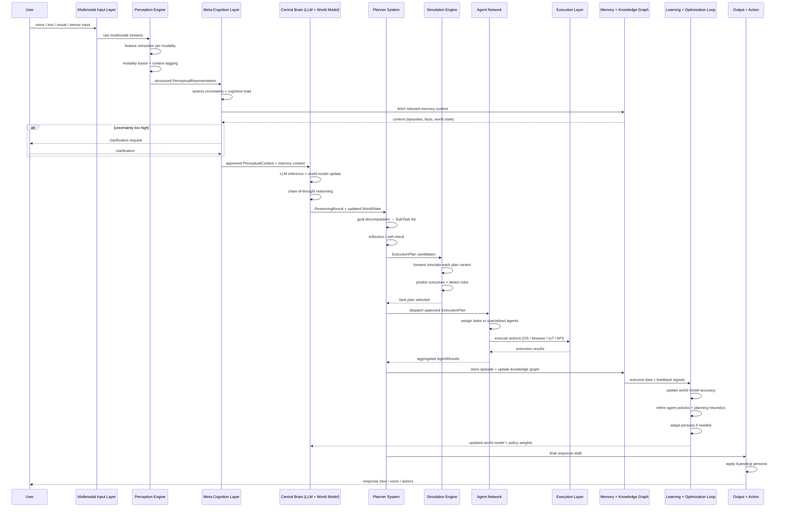
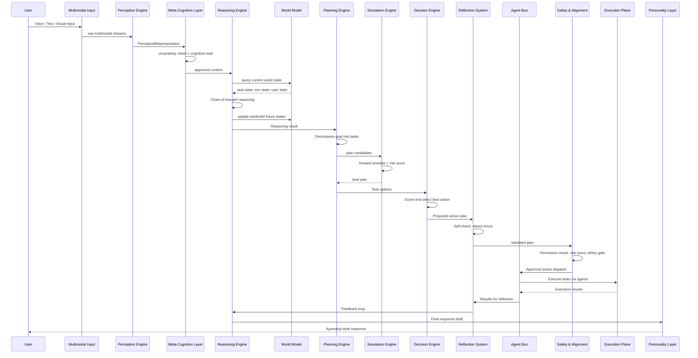
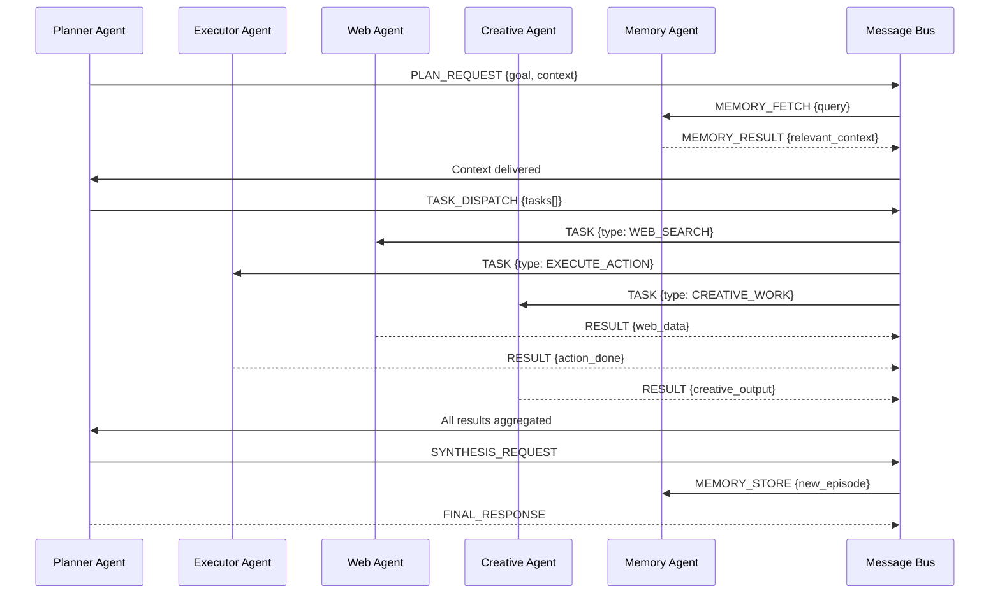
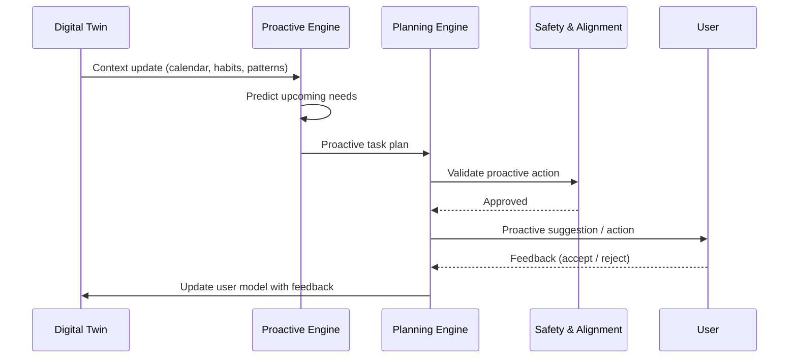
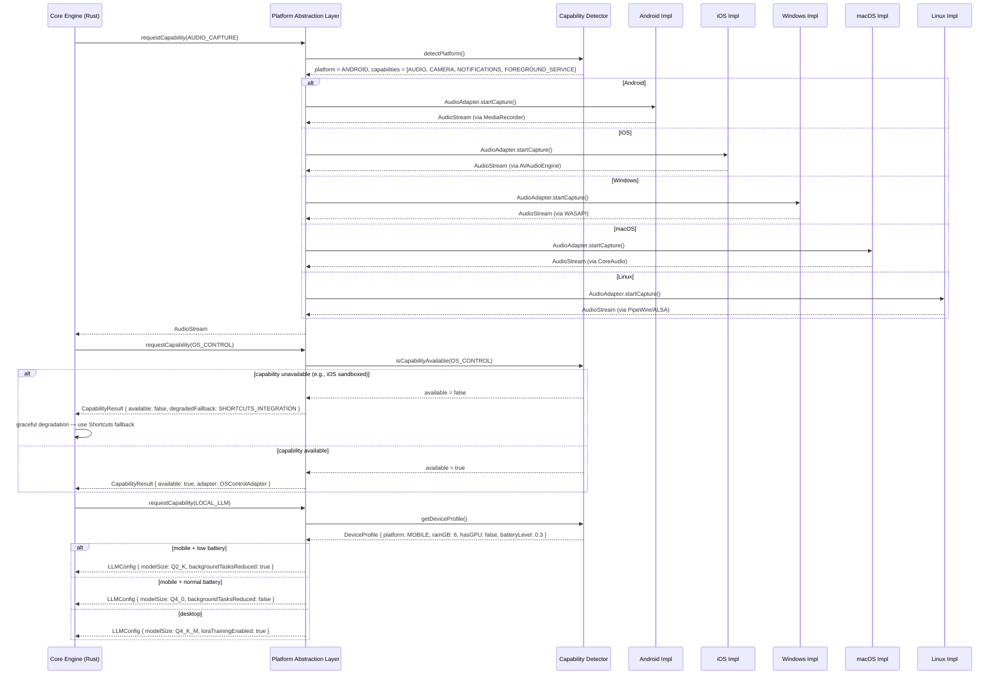

# Design Document: Personal AI Assistant (Jarvis-Level)

## Overview

A Jarvis-level personal AI assistant with a calm, highly analytical personality modeled after Ayanokoji Kiyotaka — precise, insightful, and emotionally restrained yet deeply perceptive. The system goes far beyond a single AI model: it is a coordinated multi-agent cognitive architecture with human-like memory, digital twin user modeling, full system control, real-time multimodal interaction, and continuous self-improvement.

The canonical system flow is a strict 12-layer pipeline: User → Multimodal Input Layer → Perception Engine → Meta-Cognition Layer → Central Brain (LLM + World Model) → Planner System → Simulation Engine → Agent Network → Execution Layer → Memory + Knowledge Graph → Learning + Optimization Loop → Output + Action. Every request travels this pipeline in order; no layer is bypassed. The Meta-Cognition Layer sits above the Central Brain and can pause, redirect, or escalate reasoning before any plan is formed. The Simulation Engine mentally rehearses every plan before agents execute it. The Learning + Optimization Loop closes the feedback cycle after every output.

The architecture is organized into four planes that map onto this pipeline: the Cognitive Plane (Perception Engine, Meta-Cognition, Central Brain, Planner, Simulation Engine), the Agent Plane (Agent Network coordinating via a message bus), the Memory Plane (Memory + Knowledge Graph), and the Execution Plane (Execution Layer tools and APIs). A unified Personality Layer enforces the Ayanokoji persona across every output, and a Safety & Alignment System gates every action before execution.

The design is phased: Phase 1 delivers chat + memory + simple tools; Phase 2 adds voice, automation, and web control; Phase 3 introduces the full multi-agent system; Phase 4 completes personalization and proactive intelligence.


## Architecture

### Canonical 12-Layer Pipeline

Every request flows through these layers in strict order. No layer is bypassed.

```
User
↓
Multimodal Input Layer
↓
Perception Engine
↓
Meta-Cognition Layer
↓
Central Brain (LLM + World Model)
↓
Planner System
↓
Simulation Engine
↓
Agent Network
↓
Execution Layer (Tools/APIs)
↓
Memory + Knowledge Graph
↓
Learning + Optimization Loop
↓
Output + Action
```

### Top-Level System Architecture

```mermaid
graph TD
    User([User])

    subgraph L1["Layer 1 — Multimodal Input"]
        VoiceIn[Voice Input\nSpeech Recognition]
        CameraIn[Camera / Screen Capture]
        TextIn[Text Input]
        SensorIn[IoT Sensors / Events]
    end

    subgraph L2["Layer 2 — Perception Engine"]
        FeatureExtract[Feature Extraction\nper modality]
        ModalityFusion[Modality Fusion]
        ContextTag[Context Tagging]
        PercepRepr[Perceptual Representation]
    end

    subgraph L3["Layer 3 — Meta-Cognition Layer"]
        UncertaintyDetect[Uncertainty Detector]
        ClarifyVsAct[Clarify vs Act Decision]
        CogLoadMgr[Cognitive Load Manager]
        BrainDirector[Brain Pause / Redirect Controller]
    end

    subgraph L4["Layer 4 — Central Brain"]
        LLMCore[LLM Inference Core]
        WorldModel[World Model\nTask / Env / User / Future States]
        ReasoningEngine[Reasoning Engine\nChain-of-Thought]
        DecisionEngine[Decision Engine\nAction Selection]
    end

    subgraph L5["Layer 5 — Planner System"]
        PlanningEngine[Planning Engine\nGoal Decomposition]
        ReflectionSystem[Reflection System\nSelf-Check]
        AgentAssigner[Agent Assignment]
    end

    subgraph L6["Layer 6 — Simulation Engine"]
        ForwardSim[Forward Simulator\nOutcome Prediction]
        RiskDetectSim[Risk Detector]
        PlanSelector[Best Plan Selector]
    end

    subgraph L7["Layer 7 — Agent Network"]
        PlannerAgent[Planner Agent]
        ExecutorAgent[Executor Agent]
        WebAgent[Web Agent]
        CreativeAgent[Creative Agent]
        MemoryAgent[Memory Agent]
        AgentBus[Inter-Agent Message Bus]
    end

    subgraph L8["Layer 8 — Execution Layer"]
        OSControl[OS Control\nWindows / Android]
        BrowserAuto[Browser Automation\nPlaywright]
        IoTControl[IoT Device Control]
        RPAEngine[RPA Engine]
        APIOrchestrator[API Orchestrator]
    end

    subgraph L9["Layer 9 — Memory + Knowledge Graph"]
        STM[Short-Term Memory]
        LTM[Long-Term Memory]
        EpisodicMem[Episodic Memory]
        VectorDB[Vector DB\nFAISS / Pinecone]
        KnowledgeGraph[Knowledge Graph\nNeo4j / NetworkX]
        DigitalTwin[Digital Twin\nUser Model]
    end

    subgraph L10["Layer 10 — Learning + Optimization Loop"]
        FeedbackCollect[Feedback Collector]
        WorldModelUpdater[World Model Accuracy Updater]
        PolicyRefiner[Agent Policy Refiner]
        PlanHeuristics[Planning Heuristics Optimizer]
        PersonaAdapter[Persona Adapter]
        LoRATrainer[On-Device LoRA Trainer]
    end

    subgraph L11["Layer 11 — Output + Action"]
        PersonalityLayer[Personality Layer\nAyanokoji Persona]
        TTS[Voice Synthesis]
        TextOut[Text Output]
        ActionOut[Action Confirmation]
    end

    subgraph Safety["Safety & Alignment System (cross-cutting)"]
        PermissionLayer[Permission Layer]
        EthicsEngine[Ethics Engine]
        ActionValidator[Action Validator]
        AuditLog[Audit Log]
    end

    subgraph Infra["Infrastructure Layer (cross-cutting)"]
        ModelRouter[Model Router\nOnline / Offline]
        ConnMonitor[Connectivity Monitor]
        LocalLLM[Local LLM\nOllama / llama.cpp]
        CloudGPU[Cloud GPU]
    end

    User --> L1
    L1 --> L2
    L2 --> L3
    L3 --> L4
    L4 --> L5
    L5 --> L6
    L6 --> L7
    L7 --> L8
    L8 --> L9
    L9 --> L10
    L10 --> L11
    L11 --> User

    Safety -.->|gates every action| L8
    Safety -.->|monitors| L5
    Infra -.->|routes compute| L4
    Infra -.->|routes compute| L7
    L9 -.->|context injection| L4
    L10 -.->|updates world model| L4
```




### Phased Implementation Architecture



### Cross-Platform Architecture

**Framework Recommendation: Flutter + Rust core**

Flutter is the best fit for this AI-heavy system because:
- Single Dart codebase compiles to native Android, iOS, Windows, macOS, and Linux with true native rendering (no WebView)
- Dart FFI calls into a shared Rust core for the performance-critical pipeline layers (LLM inference, vector search, audio processing)
- The Rust core (compiled as a shared library) is platform-agnostic and handles layers 2–11 identically on all platforms
- Flutter's isolate model maps cleanly onto the async agent network
- Better GPU/CPU access than React Native; avoids Electron's memory overhead for the PC app
- Alternative considered: React Native + Electron — rejected because Electron adds ~150MB overhead and React Native's desktop support is immature; Tauri + React Native — rejected because bridging two separate frameworks for mobile and desktop creates unnecessary complexity



## Sequence Diagrams

### Canonical System Flow (All 12 Layers)



### Cognitive Processing Flow



### Multi-Agent Coordination Flow



### Proactive Intelligence Flow



### Platform Abstraction Layer (PAL) Routing Flow




## Components and Interfaces

### Component 1: Perception Engine (Layer 2)

**Purpose**: Transforms raw multimodal inputs (audio, video, screen captures, text, sensor data) into structured `PerceptualRepresentation` objects. Handles per-modality feature extraction, cross-modal fusion, and context tagging so that every downstream layer receives a unified, semantically rich representation rather than raw bytes.

**Interface**:
```pascal
INTERFACE PerceptionEngine
  process(input: MultimodalInput): PerceptualRepresentation
  extractFeatures(modality: ModalityType, raw: Bytes): ModalityFeatures
  fuseModalities(features: LIST OF ModalityFeatures): FusedPercept
  tagContext(percept: FusedPercept, environmentState: EnvironmentState): PerceptualRepresentation
END INTERFACE

INTERFACE FeatureExtractor
  extractAudio(audio: AudioBytes): AudioFeatures    -- MFCCs, prosody, speaker id
  extractVisual(image: ImageBytes): VisualFeatures  -- objects, text (OCR), scene
  extractScreen(capture: ScreenCapture): ScreenFeatures  -- active app, UI elements, text
  extractText(text: String): TextFeatures           -- tokens, entities, intent signals
  extractSensor(data: MAP): SensorFeatures
END INTERFACE

INTERFACE ModalityFusion
  fuse(features: LIST OF ModalityFeatures): FusedPercept
  resolveConflicts(features: LIST OF ModalityFeatures): ResolvedFeatures
  computeAttentionWeights(features: LIST OF ModalityFeatures): AttentionMap
END INTERFACE
```

**Responsibilities**:
- Per-modality feature extraction: audio (Whisper + prosody), visual (LLaVA/CLIP), screen (OCR + UI parsing), text (tokenization + NER), sensors
- Cross-modal fusion with attention weighting — speech + screen context produces richer understanding than either alone
- Context tagging: annotate percept with environment state (active app, time, location, connectivity)
- Normalize all modalities into a single `PerceptualRepresentation` passed to the Meta-Cognition Layer
- Upstream: receives `MultimodalInput` from the Multimodal Input Layer
- Downstream: emits `PerceptualRepresentation` to the Meta-Cognition Layer

---

### Component 2: Meta-Cognition Layer (Layer 3)

**Purpose**: The "thinking about thinking" layer. Sits between the Perception Engine and the Central Brain and acts as the system's self-awareness module. Monitors reasoning quality, detects uncertainty, decides whether to ask for clarification or proceed autonomously, manages cognitive load, and can pause or redirect the Central Brain before any plan is formed.

**Interface**:
```pascal
INTERFACE MetaCognitionLayer
  evaluate(percept: PerceptualRepresentation, memoryContext: MemoryContext): MetaCognitiveDecision
  detectUncertainty(percept: PerceptualRepresentation): UncertaintyReport
  decideClarifyOrAct(uncertainty: UncertaintyReport, profile: UserProfile): ClarifyOrActDecision
  manageCognitiveLoad(activeWorkload: CognitiveWorkload): LoadManagementAction
  pauseBrain(reason: String): VOID
  redirectBrain(newFocus: String): VOID
  resumeBrain(): VOID
END INTERFACE

INTERFACE UncertaintyDetector
  scoreAmbiguity(percept: PerceptualRepresentation): Float  -- 0.0 clear to 1.0 fully ambiguous
  identifyAmbiguousSlots(percept: PerceptualRepresentation): LIST OF AmbiguousSlot
  estimateConfidence(percept: PerceptualRepresentation): Float
END INTERFACE

INTERFACE ClarificationManager
  generateClarificationQuestion(slots: LIST OF AmbiguousSlot): String
  incorporateClarification(original: PerceptualRepresentation, clarification: String): PerceptualRepresentation
  shouldAskUser(uncertainty: UncertaintyReport, profile: UserProfile): Boolean
END INTERFACE

INTERFACE CognitiveLoadManager
  getCurrentLoad(): CognitiveWorkload
  canAcceptNewTask(): Boolean
  queueTask(task: PendingTask): VOID
  getNextTask(): OPTIONAL PendingTask
END INTERFACE
```

**Responsibilities**:
- Uncertainty detection: score ambiguity of incoming percept; identify missing or conflicting slots
- Clarify vs act: if ambiguity > threshold AND user prefers clarification → ask; otherwise proceed with best interpretation
- Cognitive load management: track active reasoning threads; queue or defer low-priority tasks when overloaded
- Brain control: can issue PAUSE (stop current reasoning), REDIRECT (shift focus), or RESUME signals to the Central Brain
- Fetch relevant memory context from Memory + Knowledge Graph before passing to Central Brain
- Upstream: receives `PerceptualRepresentation` from Perception Engine
- Downstream: emits `ApprovedPerceptualContext` to Central Brain

---

### Component 3: Central Brain — LLM + World Model (Layer 4)

**Purpose**: The core reasoning unit. Combines LLM inference with a continuously updated World Model that maintains a structured representation of the user's environment, task state, and predicted future states. The World Model grounds LLM reasoning in real-world context rather than relying solely on parametric knowledge.

**Interface**:
```pascal
INTERFACE CentralBrain
  reason(context: ApprovedPerceptualContext): ReasoningResult
  updateWorldModel(observations: LIST OF Observation): VOID
  getWorldState(): WorldState
  inferGoal(reasoningResult: ReasoningResult): Goal
END INTERFACE

INTERFACE LLMCore
  infer(prompt: String, context: CognitiveContext, worldState: WorldState): LLMResponse
  chainOfThought(problem: String, context: CognitiveContext): ThoughtChain
  synthesize(thoughts: ThoughtChain, agentResults: LIST OF AgentResult): ResponseDraft
END INTERFACE

INTERFACE WorldModel
  getTaskState(): TaskState
  getEnvironmentState(): EnvironmentState
  getUserState(): UserState
  getPredictedFutureStates(horizon: Integer): LIST OF FutureState
  update(observation: Observation): VOID
  updateFromLearning(delta: WorldModelDelta): VOID
  snapshot(): WorldModelSnapshot
END INTERFACE

INTERFACE ReasoningEngine
  chainOfThought(problem: String, context: CognitiveContext): ThoughtChain
  evaluateOptions(options: LIST OF Option): RankedOptions
  synthesize(thoughts: ThoughtChain): ResponseDraft
END INTERFACE

INTERFACE DecisionEngine
  score(option: ActionOption, context: CognitiveContext): Float
  selectBest(options: LIST OF ActionOption): Decision
  explainDecision(decision: Decision): String
END INTERFACE
```

**World Model State Tracking**:
```pascal
STRUCTURE WorldState
  taskState: TaskState          -- current task, sub-tasks, progress, blockers
  environmentState: EnvironmentState  -- active apps, screen, IoT, connectivity, time
  userState: UserState          -- attention, mood signal, energy level, current activity
  predictedFutureStates: LIST OF FutureState  -- short-horizon predictions (next 1-5 steps)
  lastUpdatedAt: DateTime
  version: Integer
END STRUCTURE

STRUCTURE TaskState
  activeTaskId: OPTIONAL UUID
  description: OPTIONAL String
  progress: Float               -- 0.0 to 1.0
  subTasks: LIST OF SubTask
  blockers: LIST OF String
  estimatedCompletionAt: OPTIONAL DateTime
END STRUCTURE

STRUCTURE UserState
  attentionLevel: Float         -- 0.0 distracted to 1.0 fully focused
  moodSignal: ENUM { NEUTRAL, POSITIVE, STRESSED, TIRED }
  currentActivity: String
  lastInteractionAt: DateTime
END STRUCTURE

STRUCTURE FutureState
  horizon: Integer              -- steps ahead
  description: String
  probability: Float
  keyAssumptions: LIST OF String
END STRUCTURE
```

**Responsibilities**:
- LLM inference: multi-step chain-of-thought grounded in World Model state
- World Model maintenance: update task state, environment state, user state, and future predictions after every interaction and execution result
- Goal inference: derive explicit goal from reasoning result
- Decision engine: score and select best action option
- Upstream: receives `ApprovedPerceptualContext` from Meta-Cognition Layer
- Downstream: emits `ReasoningResult` + `WorldState` to Planner System; World Model updated by Learning + Optimization Loop

---

### Component 4: Planner System (Layer 5)

**Purpose**: Decomposes goals into executable task graphs, assigns tasks to agents, performs self-consistency reflection, and produces `ExecutionPlan` candidates for the Simulation Engine to evaluate.

**Interface**:
```pascal
INTERFACE PlannerSystem
  decompose(goal: Goal, worldState: WorldState): LIST OF ExecutionPlan
  buildExecutionPlan(tasks: LIST OF SubTask): ExecutionPlan
  replan(failedStep: SubTask, context: CognitiveContext): ExecutionPlan
  reflect(plan: ExecutionPlan): ReflectionReport
  assignAgents(tasks: LIST OF SubTask): MAP OF UUID TO String
END INTERFACE

INTERFACE PlanningEngine
  decompose(goal: Goal): LIST OF SubTask
  buildExecutionPlan(tasks: LIST OF SubTask): ExecutionPlan
  replan(failedStep: SubTask, context: CognitiveContext): ExecutionPlan
END INTERFACE

INTERFACE ReflectionSystem
  checkConsistency(plan: ExecutionPlan): ValidationResult
  detectErrors(result: ExecutionResult): LIST OF ErrorSignal
  correctCourse(errors: LIST OF ErrorSignal): CorrectionPlan
  learnFromOutcome(outcome: Outcome): VOID
END INTERFACE
```

**Responsibilities**:
- Goal-to-task decomposition with dependency resolution
- Agent capability matching for task assignment
- Self-consistency reflection before handing plans to Simulation Engine
- Replanning on agent failure
- Upstream: receives `ReasoningResult` + `WorldState` from Central Brain
- Downstream: emits `LIST OF ExecutionPlan` to Simulation Engine

---

### Component 5: Simulation Engine (Layer 6)

**Purpose**: Before any plan is executed, the Simulation Engine mentally rehearses it. Runs forward simulations of proposed action sequences to predict outcomes, detect risks, and select the best plan variant. Acts as the system's "mental rehearsal" module — no agent executes until simulation approves.

**Interface**:
```pascal
INTERFACE SimulationEngine
  simulate(plan: ExecutionPlan, worldState: WorldState): SimulationResult
  simulateAll(plans: LIST OF ExecutionPlan, worldState: WorldState): LIST OF SimulationResult
  selectBestPlan(results: LIST OF SimulationResult): ExecutionPlan
  predictOutcome(action: Action, worldState: WorldState): PredictedOutcome
  detectRisks(plan: ExecutionPlan, worldState: WorldState): LIST OF SimulatedRisk
END INTERFACE

INTERFACE ForwardSimulator
  runForward(plan: ExecutionPlan, worldState: WorldState, steps: Integer): SimulationTrace
  predictStateAfterAction(action: Action, currentState: WorldState): WorldState
  estimateSuccessProbability(plan: ExecutionPlan, worldState: WorldState): Float
END INTERFACE

INTERFACE RiskAnalyzer
  analyzeTrace(trace: SimulationTrace): LIST OF SimulatedRisk
  scoreRisk(risk: SimulatedRisk): Float
  suggestMitigation(risk: SimulatedRisk): String
END INTERFACE

INTERFACE PlanEvaluator
  score(result: SimulationResult): Float
  rank(results: LIST OF SimulationResult): LIST OF SimulationResult
  meetsThreshold(result: SimulationResult, threshold: SimulationThreshold): Boolean
END INTERFACE
```

**Data Models**:
```pascal
STRUCTURE SimulationResult
  planId: UUID
  simulatedTrace: SimulationTrace
  predictedOutcome: PredictedOutcome
  successProbability: Float     -- 0.0 to 1.0
  detectedRisks: LIST OF SimulatedRisk
  overallScore: Float           -- composite quality score
  recommended: Boolean
END STRUCTURE

STRUCTURE SimulationTrace
  steps: LIST OF SimulatedStep
  finalWorldState: WorldState
  divergencePoints: LIST OF Integer  -- step indices where outcomes branch
END STRUCTURE

STRUCTURE SimulatedStep
  stepIndex: Integer
  action: Action
  predictedStateAfter: WorldState
  confidence: Float
  alternativeOutcomes: LIST OF AlternativeOutcome
END STRUCTURE

STRUCTURE SimulatedRisk
  riskId: UUID
  description: String
  severity: ENUM { LOW, MEDIUM, HIGH, CRITICAL }
  probability: Float
  affectedSteps: LIST OF Integer
  suggestedMitigation: String
END STRUCTURE

STRUCTURE PredictedOutcome
  description: String
  goalAchieved: Boolean
  sideEffects: LIST OF String
  userImpact: String
  confidence: Float
END STRUCTURE
```

**Responsibilities**:
- Simulate each candidate plan against the current World Model state
- Predict world state after each action step
- Detect risks (irreversible actions, high-uncertainty steps, resource conflicts)
- Score and rank plans; select the best variant
- Reject plans where `successProbability < SIMULATION_THRESHOLD` or critical risks detected
- Upstream: receives `LIST OF ExecutionPlan` from Planner System
- Downstream: emits the single best `ExecutionPlan` back to Planner System for agent dispatch

---

### Component 6: Agent Network (Layer 7)

**Purpose**: A coordinated team of specialized AI agents that collaborate via a message bus to handle complex, multi-domain tasks that no single agent can complete alone.

**Interface**:
```pascal
INTERFACE AgentBus
  publish(message: AgentMessage): VOID
  subscribe(agentId: String, messageType: String, handler: PROCEDURE): VOID
  request(targetAgent: String, payload: ANY): AgentResponse
  broadcast(messageType: String, payload: ANY): VOID
  getAgentStatus(agentId: String): AgentStatus
END INTERFACE

INTERFACE BaseAgent
  agentId: String
  capabilities: LIST OF String
  handleMessage(message: AgentMessage): AgentResponse
  getStatus(): AgentStatus
  initialize(config: AgentConfig): VOID
END INTERFACE

INTERFACE PlannerAgent EXTENDS BaseAgent
  createPlan(goal: Goal, context: AgentContext): AgentPlan
  coordinateAgents(plan: AgentPlan): CoordinationResult
  synthesizeResults(results: LIST OF AgentResult): FinalResult
END INTERFACE

INTERFACE ExecutorAgent EXTENDS BaseAgent
  executeAction(action: Action): ExecutionResult
  executeWorkflow(workflow: Workflow): WorkflowResult
  reportProgress(taskId: UUID): ProgressReport
END INTERFACE

INTERFACE WebAgent EXTENDS BaseAgent
  search(query: String): LIST OF SearchResult
  scrape(url: String): PageContent
  monitorFeed(url: String, interval: Integer): VOID
  fetchAPI(endpoint: String, params: MAP): APIResponse
END INTERFACE

INTERFACE CreativeAgent EXTENDS BaseAgent
  generate(prompt: CreativePrompt): CreativeOutput
  edit(content: String, instructions: String): String
  design(spec: DesignSpec): DesignOutput
  summarize(content: String, style: SummaryStyle): String
END INTERFACE

INTERFACE MemoryAgent EXTENDS BaseAgent
  store(entry: MemoryEntry): VOID
  retrieve(query: MemoryQuery): LIST OF MemoryEntry
  consolidate(): VOID
  forget(criteria: ForgettingCriteria): VOID
  buildContext(sessionId: UUID): AgentContext
END INTERFACE
```

**Responsibilities**:
- PlannerAgent: orchestrates other agents, synthesizes results, manages task dependencies
- ExecutorAgent: performs concrete actions (OS, apps, files, APIs)
- WebAgent: internet search, scraping, API calls, feed monitoring
- CreativeAgent: content generation, editing, design, summarization
- MemoryAgent: cross-agent memory coordination, context building, consolidation
- AgentBus: async message routing, request-reply, broadcast, agent health monitoring
- Upstream: receives approved `ExecutionPlan` from Planner System (post-simulation)
- Downstream: sends actions to Execution Layer; results flow to Memory + Knowledge Graph

---

### Component 7: Execution Layer — Tools/APIs (Layer 8)

**Purpose**: Provides the assistant with the ability to control the operating system, launch and operate applications, automate workflows, control IoT devices, and perform RPA tasks. All actions are gated through Safety & Alignment before execution.

**Interface**:
```pascal
INTERFACE SystemControlLayer
  executeOSCommand(command: OSCommand): OSResult
  launchApp(appName: String, args: OPTIONAL LIST OF String): AppHandle
  closeApp(handle: AppHandle): VOID
  getRunningApps(): LIST OF AppInfo
  controlWindow(handle: AppHandle, action: WindowAction): VOID
  readClipboard(): String
  writeClipboard(content: String): VOID
  takeScreenshot(region: OPTIONAL ScreenRegion): ImageBytes
END INTERFACE

INTERFACE BrowserAutomationEngine
  openBrowser(url: String): BrowserSession
  navigate(session: BrowserSession, url: String): VOID
  click(session: BrowserSession, selector: String): VOID
  type(session: BrowserSession, selector: String, text: String): VOID
  extract(session: BrowserSession, selector: String): String
  executeScript(session: BrowserSession, script: String): ANY
  closeBrowser(session: BrowserSession): VOID
END INTERFACE

INTERFACE IoTController
  discoverDevices(): LIST OF IoTDevice
  sendCommand(deviceId: String, command: IoTCommand): IoTResult
  getDeviceState(deviceId: String): IoTDeviceState
  subscribeToEvents(deviceId: String, callback: PROCEDURE): VOID
  createAutomation(trigger: IoTTrigger, action: IoTAction): AutomationRule
END INTERFACE

INTERFACE RPAEngine
  recordWorkflow(): WorkflowRecording
  playWorkflow(recording: WorkflowRecording): WorkflowResult
  buildWorkflow(steps: LIST OF RPAStep): Workflow
  scheduleWorkflow(workflow: Workflow, schedule: CronExpression): VOID
END INTERFACE
```

**Responsibilities**:
- OS-level control: file system, processes, clipboard, screenshots (Windows/Android/Linux)
- App lifecycle management: launch, focus, close, interact
- Browser automation via Playwright/Selenium for web tasks
- IoT device discovery and control via MQTT/HTTP/Zigbee
- RPA: record-and-replay workflows, scheduled automation
- All actions gated through Safety & Alignment before execution
- Upstream: receives action commands from Agent Network
- Downstream: results flow to Memory + Knowledge Graph

---

### Component 8: Memory + Knowledge Graph (Layer 9)
**Purpose**: A five-tier human-like memory architecture providing short-term context, long-term persistence, episodic recall, semantic knowledge, vector similarity search, and graph-based relationship traversal. Also houses the Digital Twin (user model). Serves as the persistent state store for the entire pipeline.

**Interface**:
```pascal
INTERFACE AdvancedMemorySystem
  storeShortTerm(entry: Interaction): VOID
  getShortTerm(limit: Integer): LIST OF Interaction
  storeLongTerm(fact: LongTermFact): VOID
  getLongTerm(key: String): OPTIONAL LongTermFact
  storeEpisode(episode: Episode): VOID
  recallEpisode(query: String, timeRange: OPTIONAL DateRange): LIST OF Episode
  storeSemantic(knowledge: KnowledgeEntry): VOID
  querySemantic(query: String): LIST OF KnowledgeEntry
  vectorSearch(embedding: Vector, topK: Integer): LIST OF MemoryEntry
  graphQuery(cypher: String): GraphResult
  consolidateMemory(): VOID
END INTERFACE

INTERFACE VectorStore
  upsert(id: String, embedding: Vector, metadata: MAP): VOID
  search(embedding: Vector, topK: Integer, filter: OPTIONAL MAP): LIST OF VectorMatch
  delete(id: String): VOID
  getStats(): VectorStoreStats
END INTERFACE

INTERFACE KnowledgeGraph
  addNode(node: GraphNode): VOID
  addEdge(edge: GraphEdge): VOID
  query(pattern: String): LIST OF GraphPath
  getNeighbors(nodeId: String, depth: Integer): GraphSubgraph
  updateNode(nodeId: String, properties: MAP): VOID
END INTERFACE
```

**Responsibilities**:
- Short-term: sliding window of current conversation (in-session, fast access)
- Long-term: persistent key-value facts, habits, preferences (SQLite / local DB)
- Episodic: timestamped event records enabling "last week you..." recall
- Semantic: structured knowledge base for domain facts and learned information
- Vector DB (FAISS/Pinecone): embedding-based similarity search across all memory tiers
- Knowledge Graph (Neo4j/NetworkX): relationship traversal, entity linking, causal chains
- Consolidation: nightly background job merges short-term into long-term and updates graph
- Context injection: provides memory context to Meta-Cognition Layer and Central Brain
- Upstream: receives episodes and facts from Agent Network and Execution Layer
- Downstream: feeds outcome data to Learning + Optimization Loop; injects context into Meta-Cognition Layer

---

### Component 9: Learning + Optimization Loop (Layer 10)

**Purpose**: A dedicated feedback layer that sits between Memory/Knowledge Graph and Output. Continuously optimizes the system based on outcomes: updates World Model accuracy, refines agent policies, improves planning heuristics, adapts the persona, and trains on-device LoRA adapters. This is the system's self-improvement engine.

**Interface**:
```pascal
INTERFACE LearningOptimizationLoop
  processOutcome(outcome: Outcome, plan: ExecutionPlan): LearningSignals
  updateWorldModelAccuracy(signals: LearningSignals): WorldModelDelta
  refineAgentPolicies(signals: LearningSignals): PolicyUpdate
  improvePlanningHeuristics(signals: LearningSignals): HeuristicUpdate
  adaptPersona(signals: LearningSignals): PersonaUpdate
  triggerLoRAAdaptation(scope: AdaptationScope): AdaptationResult
  recordFeedback(interactionId: UUID, feedback: UserFeedback): VOID
  getLearningStats(): LearningStats
  rollbackAdaptation(version: ModelVersion): VOID
END INTERFACE

INTERFACE WorldModelUpdater
  computeAccuracyDelta(predicted: WorldState, actual: WorldState): WorldModelDelta
  applyDelta(model: WorldModel, delta: WorldModelDelta): VOID
  getAccuracyMetrics(): WorldModelAccuracyReport
END INTERFACE

INTERFACE AgentPolicyRefiner
  computePolicyGradient(outcome: Outcome, action: Action): PolicyGradient
  updatePolicy(agentId: String, gradient: PolicyGradient): VOID
  getAgentPerformanceMetrics(agentId: String): AgentMetrics
END INTERFACE

INTERFACE PlanningHeuristicsOptimizer
  analyzeSuccessfulPlans(plans: LIST OF ExecutionPlan): HeuristicPattern
  analyzeFailedPlans(plans: LIST OF ExecutionPlan): FailurePattern
  updateHeuristics(patterns: LIST OF HeuristicPattern): VOID
  getHeuristics(): LIST OF PlanningHeuristic
END INTERFACE

INTERFACE PersonaAdapter
  analyzePersonaFeedback(feedback: LIST OF UserFeedback): PersonaSignal
  adjustPersonaConfig(signal: PersonaSignal): PersonaUpdate
  getCurrentPersonaConfig(): PersonaConfig
END INTERFACE

INTERFACE FeedbackLearner
  processFeedback(feedback: UserFeedback): LearningSignal
  updateResponsePolicy(signal: LearningSignal): VOID
  getErrorPatterns(): LIST OF ErrorPattern
END INTERFACE

INTERFACE LoRATrainer
  buildTrainingExamples(interactions: LIST OF Interaction): LIST OF TrainingExample
  trainDelta(baseModel: String, examples: LIST OF TrainingExample): LoRAAdapter
  evaluateAdapter(adapter: LoRAAdapter, validationSet: LIST OF TrainingExample): Float
  saveAdapter(adapter: LoRAAdapter): String  -- returns path
END INTERFACE
```

**Responsibilities**:
- World Model accuracy: compare predicted vs actual world states after execution; compute and apply correction deltas
- Agent policy refinement: reinforcement-style updates based on task success/failure signals
- Planning heuristics: extract patterns from successful and failed plans to improve future decomposition
- Persona adaptation: adjust verbosity, insight depth, and emotional expression based on user feedback
- On-device LoRA training: fine-tune local model with high-quality interaction examples
- Model versioning: rollback if adaptation degrades quality
- All learning is local; no data transmitted externally
- Upstream: receives outcome data from Memory + Knowledge Graph
- Downstream: pushes `WorldModelDelta` and policy updates to Central Brain; pushes `PersonaUpdate` to Output + Action

---

### Component 10: Advanced Memory System — Digital Twin (User Modeling)

**Purpose**: A continuously evolving model of the user — their habits, goals, behavior patterns, preferences, and context — enabling deep personalization and proactive assistance. Housed within the Memory + Knowledge Graph layer.

**Interface**:
```pascal
INTERFACE DigitalTwin
  updateFromInteraction(interaction: Interaction): VOID
  updateFromBehavior(event: BehaviorEvent): VOID
  getUserProfile(): UserProfile
  predictNextNeed(context: UserContext): LIST OF PredictedNeed
  getGoals(): LIST OF TrackedGoal
  updateGoal(goalId: UUID, update: GoalUpdate): VOID
  getHabits(): LIST OF Habit
  getBehaviorPatterns(): LIST OF BehaviorPattern
  exportProfile(): UserProfileExport
END INTERFACE

INTERFACE BehaviorTracker
  recordEvent(event: BehaviorEvent): VOID
  detectPattern(events: LIST OF BehaviorEvent): OPTIONAL BehaviorPattern
  getActivePatterns(): LIST OF BehaviorPattern
END INTERFACE

INTERFACE GoalModeler
  inferGoal(interactions: LIST OF Interaction): OPTIONAL Goal
  trackProgress(goalId: UUID): GoalProgress
  suggestMilestone(goal: Goal): Milestone
  detectGoalConflict(goals: LIST OF Goal): LIST OF GoalConflict
END INTERFACE
```

**Responsibilities**:
- Track user habits (wake time, work hours, exercise, study patterns)
- Model explicit and inferred goals with progress tracking
- Detect behavior patterns (e.g., productivity peaks, stress indicators)
- Evolve profile continuously from every interaction and behavior event
- Enable proactive engine to predict needs before user asks
- Privacy-first: all twin data stored locally, exportable and deletable

---

### Component 12: Real-Time Intelligence Layer

**Interface**:
```pascal
INTERFACE RealTimeIntelligenceLayer
  search(query: String, sources: OPTIONAL LIST OF String): LIST OF SearchResult
  fetchWeather(location: String): WeatherData
  fetchFinance(symbol: String): FinanceData
  fetchNews(topics: LIST OF String, limit: Integer): LIST OF NewsItem
  fetchMaps(origin: String, destination: String): RouteData
  subscribeToEvent(eventType: String, filter: EventFilter, callback: PROCEDURE): Subscription
  unsubscribe(subscription: Subscription): VOID
  streamData(source: DataSource, handler: PROCEDURE): DataStream
END INTERFACE

INTERFACE APIOrchestrator
  registerAPI(spec: APISpec): VOID
  call(apiName: String, method: String, params: MAP): APIResponse
  callBatch(calls: LIST OF APICall): LIST OF APIResponse
  getRegisteredAPIs(): LIST OF APISpec
  rateLimit(apiName: String): RateLimitInfo
END INTERFACE

INTERFACE EventDrivenAlertSystem
  createAlert(condition: AlertCondition, action: AlertAction): Alert
  evaluateConditions(): VOID  -- runs on schedule
  getActiveAlerts(): LIST OF Alert
  dismissAlert(alertId: UUID): VOID
END INTERFACE
```

**Responsibilities**:
- Live web search with source filtering and result ranking
- Weather, finance, maps, news API integrations with caching
- Event-driven alerts (e.g., "notify me when BTC drops below X")
- Continuous data streaming for real-time monitoring
- API orchestrator manages rate limits, auth, retries across all integrations
- All external calls respect user privacy settings and data minimization

---

### Component 13: Continuous Learning System (legacy — superseded by Component 9)

**Purpose**: Enables the assistant to improve over time through feedback learning, behavior observation, reinforcement signals, and on-device model adaptation.

**Interface**:
```pascal
INTERFACE ContinuousLearningSystem
  recordFeedback(interactionId: UUID, feedback: UserFeedback): VOID
  observeBehavior(event: BehaviorEvent): VOID
  applyReinforcementSignal(signal: RLSignal): VOID
  triggerAdaptation(scope: AdaptationScope): AdaptationResult
  getModelVersion(): ModelVersion
  rollbackAdaptation(version: ModelVersion): VOID
  getLearningStats(): LearningStats
END INTERFACE

INTERFACE FeedbackLearner
  processFeedback(feedback: UserFeedback): LearningSignal
  updateResponsePolicy(signal: LearningSignal): VOID
  getErrorPatterns(): LIST OF ErrorPattern
END INTERFACE

INTERFACE BehaviorLearner
  observePattern(events: LIST OF BehaviorEvent): OPTIONAL LearnedPattern
  updateUserModel(pattern: LearnedPattern): VOID
  predictBehavior(context: UserContext): BehaviorPrediction
END INTERFACE

INTERFACE ReinforcementLearner
  computeReward(action: Action, outcome: Outcome): Float
  updatePolicy(state: State, action: Action, reward: Float): VOID
  selectAction(state: State): Action
END INTERFACE
```

**Responsibilities**:
- Feedback learning: explicit thumbs up/down and implicit signals (re-asks, corrections)
- Behavior learning: observe user patterns to improve predictions and suggestions
- Reinforcement learning: reward successful task completions, penalize errors
- On-device LoRA adaptation: fine-tune local model with learned preferences
- Model versioning: rollback capability if adaptation degrades quality
- All learning is local; no data transmitted externally

---

### Component 14: Proactive Intelligence Engine

**Purpose**: Anticipates user needs before they are expressed, generates autonomous suggestions, and takes pre-approved actions based on context, calendar, habits, and goals.

**Interface**:
```pascal
INTERFACE ProactiveIntelligenceEngine
  analyzeContext(context: ProactiveContext): LIST OF PredictedNeed
  generateSuggestion(need: PredictedNeed): ProactiveSuggestion
  scheduleProactiveCheck(interval: Integer): VOID
  executeProactiveAction(action: ProactiveAction, approval: ApprovalMode): ProactiveResult
  getProactiveHistory(): LIST OF ProactiveEvent
  setProactiveLevel(level: ProactiveLevel): VOID
END INTERFACE

INTERFACE NeedPredictor
  predict(userProfile: UserProfile, calendar: LIST OF CalendarEvent, time: DateTime): LIST OF PredictedNeed
  scoreUrgency(need: PredictedNeed): Float
  filterByPreference(needs: LIST OF PredictedNeed, profile: UserProfile): LIST OF PredictedNeed
END INTERFACE
```

**Responsibilities**:
- Continuously analyze calendar, habits, goals, and context for upcoming needs
- Generate ranked suggestions with urgency scores
- Support three approval modes: ASK_FIRST, AUTO_APPROVE (pre-authorized), SILENT_LOG
- Example triggers: exam tomorrow → prepare revision plan; meeting in 30min → summarize agenda
- Configurable proactive level: OFF, SUGGESTIONS_ONLY, SEMI_AUTO, FULL_AUTO
- All proactive actions logged and reversible

---

### Component 15: Safety & Alignment System (cross-cutting)

**Purpose**: A multi-layer safety gate that validates every action before execution, enforcing permission boundaries, detecting risks, applying ethical constraints, and ensuring the assistant never acts against user interests.

**Interface**:
```pascal
INTERFACE SafetyAlignmentSystem
  validate(action: ProposedAction): ValidationResult
  checkPermission(action: ProposedAction, userPermissions: PermissionSet): Boolean
  assessRisk(action: ProposedAction): RiskAssessment
  applyEthicsFilter(action: ProposedAction): EthicsResult
  requestUserApproval(action: ProposedAction): ApprovalResult
  logAction(action: ProposedAction, result: ValidationResult): VOID
  getAuditLog(filter: AuditFilter): LIST OF AuditEntry
END INTERFACE

INTERFACE PermissionLayer
  grantPermission(category: PermissionCategory, scope: PermissionScope): VOID
  revokePermission(category: PermissionCategory): VOID
  hasPermission(action: ProposedAction): Boolean
  getPermissions(): PermissionSet
END INTERFACE

INTERFACE RiskDetector
  score(action: ProposedAction): RiskScore  -- 0.0 (safe) to 1.0 (critical)
  classify(action: ProposedAction): RiskCategory
  getThreshold(category: RiskCategory): Float
END INTERFACE

INTERFACE EthicsEngine
  evaluate(action: ProposedAction): EthicsResult
  getConstraints(): LIST OF EthicsConstraint
  addConstraint(constraint: EthicsConstraint): VOID
END INTERFACE
```

**Responsibilities**:
- Permission layer: per-category grants (files, network, OS, IoT, financial, etc.)
- Risk detector: score every action 0.0–1.0; block if above threshold
- Ethics engine: hard constraints (no deception, no harm, no unauthorized data access)
- Action validator: final gate combining all checks before dispatch to execution plane
- Audit log: immutable record of all proposed and executed actions
- User approval flow: high-risk actions always require explicit confirmation

---

### Component 16: Infrastructure Layer (cross-cutting)

**Purpose**: Provides the compute, routing, and streaming infrastructure for all AI workloads — balancing local GPU/CPU execution with cloud GPU for heavy tasks, and managing real-time data pipelines.

**Interface**:
```pascal
INTERFACE InfrastructureLayer
  routeCompute(workload: ComputeWorkload): ComputeTarget
  scaleOut(workload: ComputeWorkload): ScalingResult
  getResourceUsage(): ResourceMetrics
  streamProcess(stream: DataStream, processor: StreamProcessor): ProcessedStream
  getLatencyStats(): LatencyReport
END INTERFACE

INTERFACE ModelRouter
  routeSTT(audio: Bytes, status: ConnectivityStatus): TranscriptionResult
  routeLLM(prompt: String, context: CognitiveContext, status: ConnectivityStatus): LLMResponse
  routeTTS(text: String, status: ConnectivityStatus): AudioStream
  routeVision(image: ImageBytes, status: ConnectivityStatus): VisionResult
  getActiveBackend(stage: PipelineStage): BackendInfo
  setPreferredBackend(stage: PipelineStage, preference: BackendPreference): VOID
END INTERFACE

INTERFACE ConnectivityMonitor
  getStatus(): ConnectivityStatus
  onStatusChange(callback: PROCEDURE(status: ConnectivityStatus)): VOID
  isOnline(): Boolean
END INTERFACE
```

**Responsibilities**:
- Route LLM/STT/TTS/Vision workloads to local or cloud based on connectivity and load
- Local: Ollama/llama.cpp with quantized models (Q4_K_M) on CPU/GPU
- Cloud: distributed GPU clusters for heavy reasoning and fine-tuning
- Real-time stream pipeline for continuous sensor/event data processing
- Auto-scaling: offload to cloud when local resources are saturated
- Latency monitoring and SLA enforcement per pipeline stage

---

### Component 17: Integration Layer

**Purpose**: Connects the assistant to the user's digital ecosystem — email, calendar, apps, devices, and external APIs — through a unified integration bus with central brain coordination.

**Interface**:
```pascal
INTERFACE IntegrationLayer
  connectEmail(config: EmailConfig): EmailIntegration
  connectCalendar(config: CalendarConfig): CalendarIntegration
  connectApp(appId: String, config: AppConfig): AppIntegration
  connectDevice(deviceId: String, protocol: DeviceProtocol): DeviceIntegration
  registerAPI(spec: APISpec): VOID
  getIntegrations(): LIST OF Integration
  syncAll(): SyncResult
END INTERFACE

INTERFACE EmailIntegration
  readEmails(filter: EmailFilter): LIST OF Email
  sendEmail(to: String, subject: String, body: String): VOID
  watchInbox(callback: PROCEDURE(email: Email)): VOID
  summarizeThread(threadId: String): String
END INTERFACE

INTERFACE CalendarIntegration
  getEvents(range: DateRange): LIST OF CalendarEvent
  createEvent(event: CalendarEvent): VOID
  updateEvent(eventId: String, update: EventUpdate): VOID
  deleteEvent(eventId: String): VOID
  findFreeSlot(duration: Integer, range: DateRange): OPTIONAL DateTime
END INTERFACE
```

**Responsibilities**:
- Email: read, send, watch inbox, summarize threads
- Calendar: CRUD events, find free slots, detect conflicts
- App ecosystem: connect to productivity apps, note-taking, task managers
- Device control: unified interface over OS, IoT, mobile
- API orchestration: central registry for all external API calls
- Central brain coordination: all integrations report to the Cognitive Plane

---

### Component 18: Voice Input Pipeline (Enhanced)

**Purpose**: Always-on ambient audio capture with wake word detection, noise filtering, and multimodal context attachment.

**Interface**:
```pascal
INTERFACE VoicePipeline
  startListening(): VOID
  stopListening(): VOID
  onWakeWordDetected(callback: PROCEDURE): VOID
  onTranscription(callback: PROCEDURE(text: String, confidence: Float)): VOID
  setWakeWord(word: String): VOID
  getListeningState(): ListeningState
  attachVisualContext(capture: ScreenCapture): VOID
END INTERFACE
```

---

### Component 19: Personality Layer — Ayanokoji Persona Engine (Output + Action)

**Purpose**: Filters and reformulates all response drafts through the Ayanokoji persona — calm, precise, analytically deep, minimal emotional expression, occasionally revealing subtle wit.

**Interface**:
```pascal
INTERFACE PersonalityLayer
  applyPersona(draft: ResponseDraft): PersonaResponse
  getPersonaConfig(): PersonaConfig
  updatePersonaConfig(config: PersonaConfig): VOID
END INTERFACE
```

---

### Component 20: Output Formatter (Output + Action)

**Purpose**: Renders the final response as text and optionally as synthesized speech, applying formatting appropriate to the output channel.

**Interface**:
```pascal
INTERFACE OutputFormatter
  formatText(response: PersonaResponse): String
  synthesizeSpeech(text: String): AudioStream
  renderToChannel(response: PersonaResponse, channel: OutputChannel): VOID
END INTERFACE
```

---

### Component 21: Platform Abstraction Layer (PAL)

**Purpose**: Provides a unified interface for all platform-specific capabilities so the shared core engine never calls platform APIs directly. Each capability has a concrete implementation per platform (Android, iOS, Windows, macOS, Linux). The PAL also performs capability detection and returns graceful degradation hints when a capability is unavailable on the current platform.

**Interface**:
```pascal
INTERFACE PlatformAbstractionLayer
  getCapability(capability: CapabilityType): CapabilityResult
  isAvailable(capability: CapabilityType): Boolean
  getDeviceProfile(): DeviceProfile
  getPlatform(): PlatformType
END INTERFACE

INTERFACE AudioAdapter
  startCapture(config: AudioCaptureConfig): AudioStream
  stopCapture(): VOID
  startPlayback(stream: AudioStream): VOID
  stopPlayback(): VOID
  setWakeWordEngine(engine: WakeWordEngine): VOID
END INTERFACE

INTERFACE CameraAdapter
  capturePhoto(): ImageBytes
  startVideoStream(callback: PROCEDURE(frame: ImageBytes)): VOID
  stopVideoStream(): VOID
  captureScreen(region: OPTIONAL ScreenRegion): ImageBytes
  startScreenStream(callback: PROCEDURE(frame: ImageBytes)): VOID
END INTERFACE

INTERFACE FileSystemAdapter
  read(path: String): Bytes
  write(path: String, data: Bytes): VOID
  delete(path: String): VOID
  list(directory: String): LIST OF FileInfo
  getAppDataDirectory(): String
  getDocumentsDirectory(): String
END INTERFACE

INTERFACE NotificationAdapter
  sendLocal(notification: LocalNotification): VOID
  sendPush(notification: PushNotification): VOID
  requestPermission(): Boolean
  cancelNotification(id: String): VOID
  setNotificationChannel(channel: NotificationChannel): VOID  -- Android only
END INTERFACE

INTERFACE OSControlAdapter
  -- Full support: Windows (Win32/COM), macOS (AppleScript/Accessibility), Linux (X11/Wayland/D-Bus)
  -- Degraded: Android (ADB/Accessibility API), iOS (Shortcuts/Siri integration only)
  launchApp(appId: String): AppHandle
  closeApp(handle: AppHandle): VOID
  getRunningApps(): LIST OF AppInfo
  controlWindow(handle: AppHandle, action: WindowAction): VOID
  executeShellCommand(command: String): ShellResult  -- desktop only
  registerGlobalHotkey(keys: KeyCombo, callback: PROCEDURE): VOID  -- desktop only
  showSystemTray(config: TrayConfig): VOID  -- Windows + Linux
  showMenuBar(config: MenuBarConfig): VOID  -- macOS only
END INTERFACE

INTERFACE BackgroundExecutionAdapter
  startForegroundService(config: ServiceConfig): VOID  -- Android
  stopForegroundService(): VOID  -- Android
  registerBackgroundMode(mode: BackgroundMode): VOID  -- iOS
  scheduleBackgroundTask(task: BackgroundTask): VOID
  cancelBackgroundTask(taskId: String): VOID
  isBackgroundExecutionAllowed(): Boolean
END INTERFACE

INTERFACE CapabilityDetector
  detectPlatform(): PlatformType
  getAvailableCapabilities(): LIST OF CapabilityType
  isCapabilityAvailable(capability: CapabilityType): Boolean
  getDegradedFallback(capability: CapabilityType): OPTIONAL DegradedFallback
  getDeviceProfile(): DeviceProfile
END INTERFACE
```

**Platform Capability Matrix**:
```pascal
-- Capability availability per platform
-- full = full support, degraded = partial/workaround, none = unavailable

-- AUDIO_CAPTURE:        Android full   iOS full   Windows full   macOS full   Linux full
-- CAMERA:               Android full   iOS full   Windows degr   macOS degr   Linux degr
-- SCREEN_CAPTURE:       Android degr   iOS none   Windows full   macOS full   Linux full
-- OS_CONTROL_FULL:      Android degr   iOS degr   Windows full   macOS full   Linux full
-- SHELL_COMMANDS:       Android degr   iOS none   Windows full   macOS full   Linux full
-- GLOBAL_HOTKEY:        Android none   iOS none   Windows full   macOS full   Linux full
-- SYSTEM_TRAY:          Android none   iOS none   Windows full   macOS full   Linux full
-- FOREGROUND_SERVICE:   Android full   iOS none   Windows none   macOS none   Linux none
-- BACKGROUND_AUDIO:     Android full   iOS full   Windows full   macOS full   Linux full
-- LORA_TRAINING:        Android degr   iOS none   Windows full   macOS full   Linux full
-- BROWSER_AUTOMATION:   Android none   iOS none   Windows full   macOS full   Linux full
-- IOT_HUB:              Android degr   iOS degr   Windows full   macOS full   Linux full
```

**Responsibilities**:
- Abstract all platform-specific APIs behind unified interfaces
- Capability detection: query what's available before any platform call
- Graceful degradation: return `DegradedFallback` hints when a capability is unavailable
- Battery-aware configuration: reduce background tasks and switch to lighter LLM models when `batteryLevel < BATTERY_LOW_THRESHOLD`
- Route LLM model selection based on device profile (mobile → Q2_K/Q4_0, desktop → Q4_K_M/Q5_K_M)
- Upstream: called by Core Engine (Rust) and UI Layer (Flutter)
- Downstream: delegates to platform-specific native implementations

---

### Component 22: Cross-Platform UI Layer

**Purpose**: Provides platform-adaptive user interfaces built in Flutter. Mobile uses a touch-first chat and voice interface; desktop uses a system tray, command palette, and dashboard. Shared components (conversation history, goal tracker, proactive cards) are reused across all platforms.

**Interface**:
```pascal
INTERFACE CrossPlatformUILayer
  initialize(platform: PlatformType): VOID
  renderConversation(history: LIST OF Interaction): VOID
  renderProactiveCard(suggestion: ProactiveSuggestion): VOID
  renderGoalTracker(goals: LIST OF TrackedGoal): VOID
  showNotification(notification: UINotification): VOID
  getInputMode(): InputMode  -- VOICE, TEXT, or MULTIMODAL
END INTERFACE

-- Mobile-specific (Android + iOS)
INTERFACE MobileUIAdapter
  showChatInterface(): VOID
  showVoiceButton(state: VoiceButtonState): VOID
  showNotificationCard(card: NotificationCard): VOID
  openSettings(): VOID
  showOnboardingFlow(): VOID
END INTERFACE

-- Desktop-specific (Windows + macOS + Linux)
INTERFACE DesktopUIAdapter
  showSystemTray(config: TrayConfig): VOID       -- Windows + Linux
  showMenuBar(config: MenuBarConfig): VOID        -- macOS
  openChatWindow(): VOID
  openCommandPalette(): VOID
  openDashboard(): VOID
  registerGlobalHotkey(keys: KeyCombo): VOID
  showToastNotification(toast: ToastNotification): VOID
END INTERFACE

-- Shared components (all platforms)
INTERFACE SharedUIComponents
  renderConversationHistory(history: LIST OF Interaction): Widget
  renderGoalTracker(goals: LIST OF TrackedGoal): Widget
  renderProactiveSuggestionCards(suggestions: LIST OF ProactiveSuggestion): Widget
  renderSettingsPanel(config: AppConfig): Widget
END INTERFACE
```

**Responsibilities**:
- Mobile: chat interface with voice button, notification cards, settings; touch-optimized layout
- Desktop: system tray (Windows/Linux) or menu bar (macOS) presence; global hotkey activation; command palette for power users; dashboard for goal/habit overview
- Shared: conversation history, goal tracker, proactive suggestion cards — identical logic, platform-adaptive layout
- Offline indicator: surface connectivity state in UI when operating in degraded mode
- Battery indicator: show reduced-capability mode badge when battery-aware processing is active


## Data Models

### DeviceProfile (PAL — capability and resource descriptor)
```pascal
STRUCTURE DeviceProfile
  platform: ENUM { ANDROID, IOS, WINDOWS, MACOS, LINUX }
  deviceClass: ENUM { MOBILE, DESKTOP }
  ramGB: Float
  hasGPU: Boolean
  gpuVRAMGB: OPTIONAL Float
  cpuCores: Integer
  batteryLevel: OPTIONAL Float    -- 0.0 to 1.0; null on desktop (plugged in)
  isCharging: OPTIONAL Boolean
  storageAvailableGB: Float
  osVersion: String
END STRUCTURE

STRUCTURE CapabilityResult
  capability: CapabilityType
  available: Boolean
  degradedFallback: OPTIONAL DegradedFallback
  adapter: OPTIONAL ANY             -- concrete adapter instance if available
END STRUCTURE

STRUCTURE DegradedFallback
  description: String               -- human-readable explanation
  alternativeCapability: OPTIONAL CapabilityType
  workaround: OPTIONAL String       -- e.g., "Use Shortcuts app on iOS"
END STRUCTURE
```

### MobilePlatformConfig (mobile-specific runtime config)
```pascal
STRUCTURE MobilePlatformConfig
  platform: ENUM { ANDROID, IOS }
  llmModelSize: ENUM { Q2_K, Q4_0 }        -- lighter models for mobile
  loraTrainingEnabled: Boolean              -- false on iOS, limited on Android
  backgroundServiceEnabled: Boolean
  wakeWordEnabled: Boolean
  batteryAwareMode: Boolean
  batteryLowThreshold: Float                -- default 0.2 (20%)
  reducedBackgroundTasksOnLowBattery: Boolean
  -- Android-specific
  foregroundServiceNotificationId: OPTIONAL Integer
  accessibilityServiceEnabled: OPTIONAL Boolean
  adbEnabled: OPTIONAL Boolean
  -- iOS-specific
  backgroundModes: OPTIONAL LIST OF String  -- e.g., ["audio", "fetch", "processing"]
  siriShortcutsEnabled: OPTIONAL Boolean
END STRUCTURE
```

### DesktopPlatformConfig (desktop-specific runtime config)
```pascal
STRUCTURE DesktopPlatformConfig
  platform: ENUM { WINDOWS, MACOS, LINUX }
  llmModelSize: ENUM { Q4_K_M, Q5_K_M }    -- larger models for desktop
  loraTrainingEnabled: Boolean              -- true; uses GPU if available
  globalHotkey: OPTIONAL KeyCombo
  systemTrayEnabled: Boolean                -- Windows + Linux
  menuBarEnabled: Boolean                   -- macOS
  browserAutomationEnabled: Boolean
  iotHubEnabled: Boolean
  screenCaptureEnabled: Boolean
  -- Windows-specific
  win32ApiEnabled: OPTIONAL Boolean
  -- macOS-specific
  appleScriptEnabled: OPTIONAL Boolean
  -- Linux-specific
  x11Enabled: OPTIONAL Boolean
  waylandEnabled: OPTIONAL Boolean
  dBusEnabled: OPTIONAL Boolean
END STRUCTURE
```

### DataSyncConfig (optional cross-device sync)
```pascal
STRUCTURE DataSyncConfig
  enabled: Boolean                          -- user-controlled, off by default
  encryptionKey: OPTIONAL Bytes             -- end-to-end encryption key; never transmitted
  syncTargets: LIST OF SyncTarget
  syncScope: LIST OF SyncScopeItem          -- what to sync: memory, goals, preferences
  lastSyncAt: OPTIONAL DateTime
END STRUCTURE

STRUCTURE SyncTarget
  deviceId: UUID
  deviceName: String
  platform: ENUM { ANDROID, IOS, WINDOWS, MACOS, LINUX }
  lastSeenAt: DateTime
END STRUCTURE

STRUCTURE SyncScopeItem
  dataType: ENUM { LONG_TERM_MEMORY, GOALS, PREFERENCES, CONVERSATION_HISTORY }
  enabled: Boolean
END STRUCTURE
```

### PipelineCapabilityProfile (per-platform pipeline degradation map)
```pascal
STRUCTURE PipelineCapabilityProfile
  platform: ENUM { ANDROID, IOS, WINDOWS, MACOS, LINUX }
  -- Layer 1: Multimodal Input
  voiceInputAvailable: Boolean
  cameraInputAvailable: Boolean
  screenCaptureAvailable: Boolean
  -- Layer 8: Execution
  osControlLevel: ENUM { FULL, ACCESSIBILITY_ONLY, SHORTCUTS_ONLY, NONE }
  browserAutomationAvailable: Boolean
  iotControlAvailable: Boolean
  -- Layer 10: Learning
  loraTrainingAvailable: Boolean
  loraTrainingMode: ENUM { FULL_GPU, CPU_ONLY, DISABLED }
  -- LLM
  recommendedModelSize: ENUM { Q2_K, Q4_0, Q4_K_M, Q5_K_M }
  maxContextTokens: Integer
END STRUCTURE
```

### PerceptualRepresentation (Perception Engine output)
```pascal
STRUCTURE PerceptualRepresentation
  id: UUID
  sessionId: UUID
  timestamp: DateTime
  modalityFeatures: MAP OF ModalityType TO ModalityFeatures
  fusedPercept: FusedPercept
  contextTags: LIST OF ContextTag
  ambiguityScore: Float         -- 0.0 clear to 1.0 fully ambiguous
  dominantModality: ModalityType
END STRUCTURE

STRUCTURE FusedPercept
  semanticContent: String       -- unified natural language description
  entities: LIST OF Entity
  intent: OPTIONAL String
  attentionMap: MAP OF ModalityType TO Float  -- per-modality attention weights
END STRUCTURE

STRUCTURE ContextTag
  key: String
  value: String
  source: ModalityType
  confidence: Float
END STRUCTURE
```

### MetaCognitiveDecision (Meta-Cognition Layer output)
```pascal
STRUCTURE MetaCognitiveDecision
  action: ENUM { PROCEED, CLARIFY, PAUSE, REDIRECT, DEFER }
  clarificationQuestion: OPTIONAL String
  redirectTarget: OPTIONAL String
  approvedContext: OPTIONAL ApprovedPerceptualContext
  cognitiveLoadLevel: ENUM { LOW, MEDIUM, HIGH, OVERLOADED }
  uncertaintyReport: UncertaintyReport
END STRUCTURE

STRUCTURE UncertaintyReport
  overallScore: Float           -- 0.0 to 1.0
  ambiguousSlots: LIST OF AmbiguousSlot
  confidenceEstimate: Float
  recommendedAction: ENUM { PROCEED, ASK_USER }
END STRUCTURE

STRUCTURE AmbiguousSlot
  slotName: String
  possibleValues: LIST OF String
  confidencePerValue: MAP OF String TO Float
END STRUCTURE

STRUCTURE ApprovedPerceptualContext
  percept: PerceptualRepresentation
  memoryContext: MemoryContext
  worldState: WorldState
  metaCognitiveNotes: LIST OF String
END STRUCTURE
```

### WorldState (Central Brain — World Model)
```pascal
STRUCTURE WorldState
  taskState: TaskState
  environmentState: EnvironmentState
  userState: UserState
  predictedFutureStates: LIST OF FutureState
  lastUpdatedAt: DateTime
  version: Integer
END STRUCTURE

STRUCTURE TaskState
  activeTaskId: OPTIONAL UUID
  description: OPTIONAL String
  progress: Float
  subTasks: LIST OF SubTask
  blockers: LIST OF String
  estimatedCompletionAt: OPTIONAL DateTime
END STRUCTURE

STRUCTURE UserState
  attentionLevel: Float
  moodSignal: ENUM { NEUTRAL, POSITIVE, STRESSED, TIRED }
  currentActivity: String
  lastInteractionAt: DateTime
END STRUCTURE

STRUCTURE FutureState
  horizon: Integer
  description: String
  probability: Float
  keyAssumptions: LIST OF String
END STRUCTURE

STRUCTURE WorldModelDelta
  deltaId: UUID
  source: ENUM { EXECUTION_RESULT, LEARNING_LOOP, OBSERVATION }
  taskStateDelta: OPTIONAL TaskState
  environmentStateDelta: OPTIONAL EnvironmentState
  userStateDelta: OPTIONAL UserState
  futurePredictionUpdates: LIST OF FutureState
  appliedAt: DateTime
END STRUCTURE
```

### SimulationResult (Simulation Engine output)
```pascal
STRUCTURE SimulationResult
  planId: UUID
  simulatedTrace: SimulationTrace
  predictedOutcome: PredictedOutcome
  successProbability: Float
  detectedRisks: LIST OF SimulatedRisk
  overallScore: Float
  recommended: Boolean
END STRUCTURE

STRUCTURE SimulationTrace
  steps: LIST OF SimulatedStep
  finalWorldState: WorldState
  divergencePoints: LIST OF Integer
END STRUCTURE

STRUCTURE SimulatedStep
  stepIndex: Integer
  action: Action
  predictedStateAfter: WorldState
  confidence: Float
  alternativeOutcomes: LIST OF AlternativeOutcome
END STRUCTURE

STRUCTURE SimulatedRisk
  riskId: UUID
  description: String
  severity: ENUM { LOW, MEDIUM, HIGH, CRITICAL }
  probability: Float
  affectedSteps: LIST OF Integer
  suggestedMitigation: String
END STRUCTURE

STRUCTURE PredictedOutcome
  description: String
  goalAchieved: Boolean
  sideEffects: LIST OF String
  userImpact: String
  confidence: Float
END STRUCTURE
```

### LearningSignals (Learning + Optimization Loop)
```pascal
STRUCTURE LearningSignals
  signalId: UUID
  sourceOutcome: Outcome
  worldModelAccuracyDelta: Float    -- positive = model was accurate
  agentPolicySignals: MAP OF String TO Float  -- agentId → reward signal
  planningHeuristicSignals: LIST OF HeuristicSignal
  personaFeedbackSignal: OPTIONAL PersonaSignal
  generatedAt: DateTime
END STRUCTURE

STRUCTURE HeuristicSignal
  heuristicId: String
  wasHelpful: Boolean
  confidenceDelta: Float
END STRUCTURE

STRUCTURE PersonaSignal
  verbosityFeedback: OPTIONAL Float   -- negative = too verbose
  insightDepthFeedback: OPTIONAL Float
  toneCorrection: OPTIONAL String
END STRUCTURE

STRUCTURE PolicyUpdate
  agentId: String
  updatedWeights: MAP OF String TO Float
  appliedAt: DateTime
END STRUCTURE
```

### MultimodalInput
```pascal
STRUCTURE MultimodalInput
  id: UUID
  source: ENUM { VOICE, TEXT, CAMERA, SCREEN, SENSOR }
  rawText: OPTIONAL String
  audioData: OPTIONAL Bytes
  imageData: OPTIONAL Bytes
  screenCapture: OPTIONAL ScreenCapture
  sensorData: OPTIONAL MAP OF String TO ANY
  timestamp: DateTime
  sessionId: UUID
  attachedContext: OPTIONAL MultimodalContext
END STRUCTURE
```

### CognitiveContext
```pascal
STRUCTURE CognitiveContext
  sessionId: UUID
  shortTermMemory: LIST OF Interaction
  relevantEpisodes: LIST OF Episode
  activeGoals: LIST OF TrackedGoal
  userProfile: UserProfile
  environmentState: EnvironmentState
  currentTime: DateTime
END STRUCTURE
```

### ExecutionPlan
```pascal
STRUCTURE ExecutionPlan
  planId: UUID
  goal: Goal
  tasks: LIST OF SubTask
  agentAssignments: MAP OF UUID TO String  -- taskId → agentId
  estimatedDuration: Integer  -- seconds
  riskLevel: Float  -- 0.0 to 1.0
  requiresApproval: Boolean
END STRUCTURE

STRUCTURE SubTask
  taskId: UUID
  description: String
  assignedAgent: String
  toolName: OPTIONAL String
  parameters: MAP OF String TO ANY
  dependsOn: LIST OF UUID
  retryLimit: Integer
  timeoutSeconds: Integer
END STRUCTURE
```

### AgentMessage
```pascal
STRUCTURE AgentMessage
  messageId: UUID
  fromAgent: String
  toAgent: OPTIONAL String  -- null = broadcast
  messageType: ENUM { TASK_REQUEST, TASK_RESULT, MEMORY_FETCH, MEMORY_STORE, STATUS_UPDATE, ERROR }
  payload: ANY
  correlationId: OPTIONAL UUID
  timestamp: DateTime
  priority: ENUM { LOW, NORMAL, HIGH, CRITICAL }
END STRUCTURE
```

### Episode (Episodic Memory)
```pascal
STRUCTURE Episode
  episodeId: UUID
  userId: UUID
  title: String
  summary: String
  fullContent: String
  embedding: Vector
  timestamp: DateTime
  tags: LIST OF String
  relatedGoals: LIST OF UUID
  emotionalValence: OPTIONAL Float  -- -1.0 negative to 1.0 positive
END STRUCTURE
```

### LongTermFact
```pascal
STRUCTURE LongTermFact
  factId: UUID
  key: String
  value: ANY
  confidence: Float
  source: ENUM { USER_STATED, INFERRED, OBSERVED }
  createdAt: DateTime
  lastConfirmedAt: DateTime
  expiresAt: OPTIONAL DateTime
END STRUCTURE
```

### UserProfile (Digital Twin)
```pascal
STRUCTURE UserProfile
  userId: UUID
  name: String
  habits: LIST OF Habit
  goals: LIST OF TrackedGoal
  behaviorPatterns: LIST OF BehaviorPattern
  preferences: MAP OF String TO ANY
  topicWeights: MAP OF String TO Float
  communicationStyle: CommunicationStyle
  scheduleModel: ScheduleModel
  digitalTwinVersion: Integer
  lastUpdatedAt: DateTime
END STRUCTURE

STRUCTURE Habit
  habitId: UUID
  name: String
  frequency: ENUM { DAILY, WEEKLY, MONTHLY, IRREGULAR }
  typicalTime: OPTIONAL TimeOfDay
  strength: Float  -- 0.0 weak to 1.0 strong
  lastObservedAt: DateTime
END STRUCTURE

STRUCTURE BehaviorPattern
  patternId: UUID
  description: String
  triggerConditions: LIST OF String
  observedCount: Integer
  confidence: Float
  firstObservedAt: DateTime
END STRUCTURE

STRUCTURE ScheduleModel
  wakeTime: OPTIONAL TimeOfDay
  sleepTime: OPTIONAL TimeOfDay
  workHours: OPTIONAL TimeRange
  peakProductivityWindow: OPTIONAL TimeRange
  regularCommitments: LIST OF RecurringEvent
END STRUCTURE
```

### PredictedNeed
```pascal
STRUCTURE PredictedNeed
  needId: UUID
  description: String
  urgency: Float  -- 0.0 to 1.0
  triggerReason: String
  suggestedAction: ProactiveSuggestion
  predictedAt: DateTime
  relevantBy: OPTIONAL DateTime
END STRUCTURE
```

### ProposedAction
```pascal
STRUCTURE ProposedAction
  actionId: UUID
  description: String
  category: ENUM { OS_CONTROL, BROWSER, IOT, API_CALL, FILE_SYSTEM, EMAIL, CALENDAR, FINANCIAL, OTHER }
  parameters: MAP OF String TO ANY
  riskLevel: Float
  reversible: Boolean
  requiresNetwork: Boolean
  proposedBy: String  -- agentId or "user"
END STRUCTURE
```

### ValidationResult
```pascal
STRUCTURE ValidationResult
  actionId: UUID
  approved: Boolean
  permissionGranted: Boolean
  riskScore: Float
  ethicsResult: EthicsResult
  requiresUserApproval: Boolean
  rejectionReason: OPTIONAL String
END STRUCTURE
```

### RiskAssessment
```pascal
STRUCTURE RiskAssessment
  score: Float  -- 0.0 safe to 1.0 critical
  category: ENUM { SAFE, LOW, MEDIUM, HIGH, CRITICAL }
  factors: LIST OF String
  mitigations: LIST OF String
END STRUCTURE
```

### LearningStats
```pascal
STRUCTURE LearningStats
  totalFeedbackEvents: Integer
  positiveSignals: Integer
  negativeSignals: Integer
  adaptationCount: Integer
  currentModelVersion: ModelVersion
  lastAdaptationAt: OPTIONAL DateTime
  improvementScore: Float  -- rolling quality metric
END STRUCTURE
```

### EnvironmentState
```pascal
STRUCTURE EnvironmentState
  connectivity: ConnectivityStatus
  activeApps: LIST OF AppInfo
  currentScreen: OPTIONAL ScreenAnalysis
  iotDeviceStates: MAP OF String TO IoTDeviceState
  calendarEvents: LIST OF CalendarEvent
  localTime: DateTime
  location: OPTIONAL String
END STRUCTURE
```

### ConnectivityStatus
```pascal
STRUCTURE ConnectivityStatus
  state: ENUM { ONLINE, OFFLINE, DEGRADED }
  lastChecked: DateTime
  latencyMs: OPTIONAL Integer
END STRUCTURE
```

### PersonaConfig
```pascal
STRUCTURE PersonaConfig
  name: String
  intensity: Float          -- 0.0 neutral to 1.0 full Ayanokoji
  verbosity: ENUM { MINIMAL, BALANCED, DETAILED }
  emotionalExpression: Float
  insightDepth: ENUM { SURFACE, MODERATE, DEEP }
END STRUCTURE
```

### ModelVersion
```pascal
STRUCTURE ModelVersion
  versionId: UUID
  baseModel: String
  loraAdapterPath: OPTIONAL String
  adaptationCount: Integer
  createdAt: DateTime
  qualityScore: Float
END STRUCTURE
```


## Algorithmic Pseudocode

### Master Cognitive Processing Algorithm (12-Layer Pipeline)

```pascal
ALGORITHM processPipeline(rawInput)
INPUT: rawInput of type MultimodalInput
OUTPUT: response of type PersonaResponse

BEGIN
  ASSERT rawInput IS NOT NULL

  -- ── Layer 2: Perception Engine ──────────────────────────────────────────
  percept ← PerceptionEngine.process(rawInput)
  ASSERT percept.ambiguityScore >= 0.0 AND percept.ambiguityScore <= 1.0

  -- ── Layer 3: Meta-Cognition Layer ───────────────────────────────────────
  memoryContext ← MemorySystem.buildContext(rawInput.sessionId)
  metaDecision ← MetaCognitionLayer.evaluate(percept, memoryContext)

  IF metaDecision.action = CLARIFY THEN
    RETURN PersonaResponse { content: metaDecision.clarificationQuestion, requiresUserInput: true }
  END IF

  IF metaDecision.action = PAUSE OR metaDecision.action = DEFER THEN
    CognitiveLoadManager.queueTask(PendingTask { percept: percept })
    RETURN PersonaResponse { content: "Noted. I'll address this shortly.", deferred: true }
  END IF

  approvedContext ← metaDecision.approvedContext

  -- ── Layer 4: Central Brain (LLM + World Model) ──────────────────────────
  WorldModel.update(buildObservation(approvedContext))
  worldState ← WorldModel.getWorldState()
  reasoningResult ← LLMCore.chainOfThought(approvedContext.percept.fusedPercept.semanticContent, approvedContext)
  goal ← CentralBrain.inferGoal(reasoningResult)

  -- ── Layer 5: Planner System ─────────────────────────────────────────────
  planCandidates ← PlannerSystem.decompose(goal, worldState)
  FOR each plan IN planCandidates DO
    reflectionReport ← ReflectionSystem.checkConsistency(plan)
    IF reflectionReport.hasErrors THEN
      plan ← ReflectionSystem.correctCourse(reflectionReport.errors)
    END IF
  END FOR

  -- ── Layer 6: Simulation Engine ──────────────────────────────────────────
  simResults ← SimulationEngine.simulateAll(planCandidates, worldState)
  bestPlan ← SimulationEngine.selectBestPlan(simResults)

  IF bestPlan IS NULL THEN
    RETURN PersonaResponse { content: "I was unable to find a safe plan for this request.", error: true }
  END IF

  -- Safety gate before agent dispatch
  FOR each action IN bestPlan.actions DO
    validation ← SafetyAlignmentSystem.validate(action)
    IF NOT validation.approved THEN
      bestPlan.actions.remove(action)
      bestPlan.rejectedActions.append(action)
    END IF
  END FOR

  -- ── Layer 7: Agent Network ──────────────────────────────────────────────
  agentResults ← AgentBus.dispatch(bestPlan)

  -- ── Layer 8: Execution Layer ────────────────────────────────────────────
  -- (executed by agents above; results returned in agentResults)

  -- ── Layer 9: Memory + Knowledge Graph ───────────────────────────────────
  episode ← buildEpisode(rawInput, agentResults)
  MemorySystem.storeEpisode(episode)
  DigitalTwin.updateFromInteraction(buildInteraction(rawInput, agentResults))
  WorldModel.update(buildObservationFromResults(agentResults))

  -- ── Layer 10: Learning + Optimization Loop ──────────────────────────────
  outcome ← buildOutcome(bestPlan, agentResults)
  learningSignals ← LearningOptimizationLoop.processOutcome(outcome, bestPlan)
  worldModelDelta ← LearningOptimizationLoop.updateWorldModelAccuracy(learningSignals)
  WorldModel.updateFromLearning(worldModelDelta)
  LearningOptimizationLoop.refineAgentPolicies(learningSignals)
  LearningOptimizationLoop.improvePlanningHeuristics(learningSignals)

  -- ── Layer 11: Output + Action ────────────────────────────────────────────
  draft ← ResponseDraft { content: LLMCore.synthesize(reasoningResult, agentResults) }
  response ← PersonalityLayer.applyPersona(draft)

  ASSERT response.content IS NOT NULL AND response.content != ""
  RETURN response
END
```

**Preconditions:**
- All 12 pipeline layers initialized
- At least one input modality (text, audio, or visual) is present
- World Model has been initialized (may be empty on first run)

**Postconditions:**
- Non-empty PersonaResponse returned (or a clarification/deferral response)
- Episode stored in episodic memory
- World Model updated with latest observations and learning deltas
- All executed actions passed safety validation
- Learning signals processed and applied

---

### Perception Engine Algorithm

```pascal
ALGORITHM perceive(input)
INPUT: input of type MultimodalInput
OUTPUT: percept of type PerceptualRepresentation

BEGIN
  ASSERT input IS NOT NULL
  features ← EMPTY LIST

  -- Step 1: Per-modality feature extraction (parallel)
  IF input.audioData IS NOT NULL THEN
    audioFeatures ← FeatureExtractor.extractAudio(input.audioData)
    features.append(audioFeatures)
  END IF
  IF input.imageData IS NOT NULL THEN
    visualFeatures ← FeatureExtractor.extractVisual(input.imageData)
    features.append(visualFeatures)
  END IF
  IF input.screenCapture IS NOT NULL THEN
    screenFeatures ← FeatureExtractor.extractScreen(input.screenCapture)
    features.append(screenFeatures)
  END IF
  IF input.rawText IS NOT NULL THEN
    textFeatures ← FeatureExtractor.extractText(input.rawText)
    features.append(textFeatures)
  END IF
  IF input.sensorData IS NOT NULL THEN
    sensorFeatures ← FeatureExtractor.extractSensor(input.sensorData)
    features.append(sensorFeatures)
  END IF

  ASSERT features IS NOT EMPTY

  -- Step 2: Cross-modal fusion
  fusedPercept ← ModalityFusion.fuse(features)

  -- Step 3: Context tagging
  envState ← WorldModel.getWorldState().environmentState
  percept ← PerceptionEngine.tagContext(fusedPercept, envState)

  ASSERT percept.ambiguityScore >= 0.0 AND percept.ambiguityScore <= 1.0
  RETURN percept
END
```

**Preconditions:**
- At least one modality in `input` is non-null
- Feature extractors for all present modalities are initialized

**Postconditions:**
- Returns a `PerceptualRepresentation` with `ambiguityScore` in [0.0, 1.0]
- `fusedPercept.semanticContent` is non-empty
- All present modalities are represented in `modalityFeatures`

---

### Meta-Cognition Algorithm

```pascal
ALGORITHM evaluateMetaCognition(percept, memoryContext)
INPUT: percept of type PerceptualRepresentation, memoryContext of type MemoryContext
OUTPUT: decision of type MetaCognitiveDecision

BEGIN
  ASSERT percept IS NOT NULL

  -- Step 1: Assess uncertainty
  uncertaintyReport ← UncertaintyDetector.scoreAmbiguity(percept)

  -- Step 2: Check cognitive load
  loadLevel ← CognitiveLoadManager.getCurrentLoad()
  IF loadLevel = OVERLOADED THEN
    RETURN MetaCognitiveDecision { action: DEFER, cognitiveLoadLevel: OVERLOADED }
  END IF

  -- Step 3: Decide clarify vs act
  userProfile ← DigitalTwin.getUserProfile()
  IF uncertaintyReport.overallScore > AMBIGUITY_THRESHOLD AND
     ClarificationManager.shouldAskUser(uncertaintyReport, userProfile) THEN
    question ← ClarificationManager.generateClarificationQuestion(uncertaintyReport.ambiguousSlots)
    RETURN MetaCognitiveDecision {
      action: CLARIFY,
      clarificationQuestion: question,
      uncertaintyReport: uncertaintyReport
    }
  END IF

  -- Step 4: Build approved context and proceed
  worldState ← WorldModel.getWorldState()
  approvedContext ← ApprovedPerceptualContext {
    percept: percept,
    memoryContext: memoryContext,
    worldState: worldState,
    metaCognitiveNotes: buildNotes(uncertaintyReport, loadLevel)
  }

  RETURN MetaCognitiveDecision {
    action: PROCEED,
    approvedContext: approvedContext,
    cognitiveLoadLevel: loadLevel,
    uncertaintyReport: uncertaintyReport
  }
END
```

**Preconditions:**
- `AMBIGUITY_THRESHOLD` is configured (e.g., 0.65)
- World Model is initialized
- Digital Twin has a user profile

**Postconditions:**
- Returns a `MetaCognitiveDecision` with a non-null `action`
- If `action = PROCEED`, `approvedContext` is non-null
- If `action = CLARIFY`, `clarificationQuestion` is non-empty
- Cognitive load is never exceeded; overloaded state always results in DEFER

---

### Simulation Engine Algorithm

```pascal
ALGORITHM simulatePlans(planCandidates, worldState)
INPUT: planCandidates of type LIST OF ExecutionPlan, worldState of type WorldState
OUTPUT: bestPlan of type OPTIONAL ExecutionPlan

BEGIN
  ASSERT planCandidates IS NOT EMPTY
  ASSERT worldState IS NOT NULL

  simResults ← EMPTY LIST

  -- Step 1: Simulate each candidate plan
  FOR each plan IN planCandidates DO
    trace ← ForwardSimulator.runForward(plan, worldState, steps = plan.tasks.size)
    risks ← RiskAnalyzer.analyzeTrace(trace)
    outcome ← PredictedOutcome {
      goalAchieved: trace.finalWorldState.taskState.progress >= 1.0,
      sideEffects: extractSideEffects(trace),
      confidence: computeTraceConfidence(trace)
    }
    successProb ← ForwardSimulator.estimateSuccessProbability(plan, worldState)
    score ← PlanEvaluator.score(SimulationResult {
      planId: plan.planId,
      simulatedTrace: trace,
      predictedOutcome: outcome,
      successProbability: successProb,
      detectedRisks: risks
    })
    simResults.append(SimulationResult {
      planId: plan.planId,
      simulatedTrace: trace,
      predictedOutcome: outcome,
      successProbability: successProb,
      detectedRisks: risks,
      overallScore: score
    })
  END FOR

  -- Step 2: Filter out plans with critical risks or below threshold
  viablePlans ← FILTER simResults WHERE
    result.successProbability >= SIMULATION_THRESHOLD AND
    NOT ANY risk IN result.detectedRisks WHERE risk.severity = CRITICAL

  IF viablePlans IS EMPTY THEN
    RETURN NULL
  END IF

  -- Step 3: Rank and select best
  ranked ← PlanEvaluator.rank(viablePlans)
  best ← ranked.first
  best.recommended ← true

  ASSERT best.successProbability >= SIMULATION_THRESHOLD
  RETURN getPlanById(planCandidates, best.planId)
END
```

**Preconditions:**
- `SIMULATION_THRESHOLD` is configured (e.g., 0.6)
- `ForwardSimulator` has access to the current World Model
- All plan candidates have non-empty task lists

**Postconditions:**
- Returns the plan with the highest score that meets the threshold and has no critical risks
- Returns NULL if no viable plan exists
- All simulated risks are documented

**Loop Invariants:**
- All plans in `simResults` have been fully simulated before ranking
- `viablePlans` only contains plans with `successProbability >= SIMULATION_THRESHOLD`

---

### Learning + Optimization Loop Algorithm

```pascal
ALGORITHM runLearningLoop(outcome, executedPlan)
INPUT: outcome of type Outcome, executedPlan of type ExecutionPlan
OUTPUT: signals of type LearningSignals

BEGIN
  ASSERT outcome IS NOT NULL
  ASSERT executedPlan IS NOT NULL

  -- Step 1: Compute world model accuracy
  predictedFinalState ← executedPlan.simulationResult.simulatedTrace.finalWorldState
  actualFinalState ← WorldModel.getWorldState()
  accuracyDelta ← WorldModelUpdater.computeAccuracyDelta(predictedFinalState, actualFinalState)
  WorldModelUpdater.applyDelta(WorldModel, accuracyDelta)

  -- Step 2: Refine agent policies
  FOR each agentId IN executedPlan.agentAssignments.values DO
    gradient ← AgentPolicyRefiner.computePolicyGradient(outcome, getAgentActions(executedPlan, agentId))
    AgentPolicyRefiner.updatePolicy(agentId, gradient)
  END FOR

  -- Step 3: Update planning heuristics
  IF outcome.success THEN
    pattern ← PlanningHeuristicsOptimizer.analyzeSuccessfulPlans([executedPlan])
    PlanningHeuristicsOptimizer.updateHeuristics([pattern])
  ELSE
    failurePattern ← PlanningHeuristicsOptimizer.analyzeFailedPlans([executedPlan])
    PlanningHeuristicsOptimizer.updateHeuristics([failurePattern])
  END IF

  -- Step 4: Adapt persona if feedback available
  recentFeedback ← MemorySystem.getRecentFeedback(limit = 20)
  IF recentFeedback IS NOT EMPTY THEN
    personaSignal ← PersonaAdapter.analyzePersonaFeedback(recentFeedback)
    personaUpdate ← PersonaAdapter.adjustPersonaConfig(personaSignal)
    PersonalityLayer.applyUpdate(personaUpdate)
  END IF

  -- Step 5: Check LoRA adaptation threshold
  stats ← getLearningStats()
  IF stats.totalFeedbackEvents >= LORA_ADAPTATION_THRESHOLD THEN
    goodInteractions ← filterByQuality(MemorySystem.getShortTerm(200), minScore = 0.7)
    examples ← LoRATrainer.buildTrainingExamples(goodInteractions)
    adapter ← LoRATrainer.trainDelta(LocalLLM.getBaseModel(), examples)
    qualityScore ← LoRATrainer.evaluateAdapter(adapter, validationSet)
    IF qualityScore > currentModel.qualityScore THEN
      path ← LoRATrainer.saveAdapter(adapter)
      LocalLLM.loadAdapter(path)
    END IF
  END IF

  RETURN LearningSignals {
    worldModelAccuracyDelta: accuracyDelta,
    agentPolicySignals: buildPolicySignalMap(executedPlan, outcome),
    generatedAt: now()
  }
END
```

**Preconditions:**
- World Model has a snapshot of the predicted final state from simulation
- `LORA_ADAPTATION_THRESHOLD` is configured

**Postconditions:**
- World Model accuracy updated based on prediction vs actual divergence
- All agent policies updated with outcome-based gradients
- Planning heuristics updated with success or failure patterns
- If LoRA adaptation occurs, new model version has qualityScore >= previous
- No training data transmitted externally

---

### Multi-Agent Coordination Algorithm
INPUT: plan of type ExecutionPlan
OUTPUT: result of type CoordinationResult

BEGIN
  ASSERT plan.tasks IS NOT EMPTY

  pendingTasks ← topologicalSort(plan.tasks)
  completedResults ← EMPTY MAP  -- taskId → AgentResult
  failedTasks ← EMPTY LIST
  inFlight ← EMPTY MAP  -- taskId → Future

  WHILE pendingTasks IS NOT EMPTY OR inFlight IS NOT EMPTY DO
    -- Dispatch all tasks whose dependencies are satisfied
    FOR each task IN pendingTasks DO
      IF allDependenciesMet(task, completedResults) THEN
        agent ← plan.agentAssignments[task.taskId]
        future ← AgentBus.request(agent, task)
        inFlight[task.taskId] ← future
        pendingTasks.remove(task)
      END IF
    END FOR

    -- Collect completed futures
    FOR each (taskId, future) IN inFlight DO
      IF future.isDone() THEN
        result ← future.get()
        IF result.success THEN
          completedResults[taskId] ← result
        ELSE
          failedTasks.append(taskId)
        END IF
        inFlight.remove(taskId)
      END IF
    END FOR

    sleep(10ms)  -- yield CPU
  END WHILE

  ASSERT completedResults.size + failedTasks.size = plan.tasks.size

  RETURN CoordinationResult {
    planId: plan.planId,
    completedResults: completedResults,
    failedTasks: failedTasks,
    success: failedTasks IS EMPTY
  }
END
```

**Preconditions:**
- All agents referenced in `plan.agentAssignments` are registered and available
- `plan.tasks` has no circular dependencies

**Postconditions:**
- Every task accounted for in completedResults or failedTasks
- Dependency ordering respected throughout execution

**Loop Invariants:**
- All tasks in completedResults had their dependencies satisfied before dispatch
- `inFlight` only contains tasks currently executing

---

### Memory Consolidation Algorithm

```pascal
ALGORITHM consolidateMemory(userId)
INPUT: userId of type UUID
OUTPUT: consolidationReport of type ConsolidationReport

BEGIN
  -- Step 1: Fetch recent short-term interactions
  recentInteractions ← MemorySystem.getShortTerm(limit = 100)

  -- Step 2: Cluster into episodes
  clusters ← clusterByTopic(recentInteractions)
  newEpisodes ← EMPTY LIST

  FOR each cluster IN clusters DO
    IF cluster.size >= MIN_EPISODE_SIZE THEN
      episode ← Episode {
        title: inferTitle(cluster),
        summary: summarize(cluster),
        fullContent: concatenate(cluster),
        embedding: embed(summarize(cluster)),
        timestamp: cluster.first.timestamp,
        tags: extractTags(cluster)
      }
      newEpisodes.append(episode)
    END IF
  END FOR

  -- Step 3: Store episodes and update vector index
  FOR each episode IN newEpisodes DO
    MemorySystem.storeEpisode(episode)
    VectorStore.upsert(episode.episodeId, episode.embedding, episode.metadata)
  END FOR

  -- Step 4: Update knowledge graph with new entities and relations
  FOR each episode IN newEpisodes DO
    entities ← extractEntities(episode.fullContent)
    relations ← extractRelations(episode.fullContent)
    FOR each entity IN entities DO
      KnowledgeGraph.addNode(entity)
    END FOR
    FOR each relation IN relations DO
      KnowledgeGraph.addEdge(relation)
    END FOR
  END FOR

  -- Step 5: Update long-term facts from confirmed patterns
  patterns ← DigitalTwin.getBehaviorPatterns()
  FOR each pattern IN patterns DO
    IF pattern.confidence >= FACT_CONFIDENCE_THRESHOLD THEN
      MemorySystem.storeLongTerm(LongTermFact {
        key: pattern.description,
        value: true,
        confidence: pattern.confidence,
        source: OBSERVED
      })
    END IF
  END FOR

  RETURN ConsolidationReport {
    episodesCreated: newEpisodes.size,
    factsUpdated: updatedFacts.size,
    graphNodesAdded: addedNodes.size
  }
END
```

**Preconditions:**
- Memory system is accessible
- Vector store and knowledge graph are initialized

**Postconditions:**
- All qualifying interaction clusters converted to episodes
- Vector index updated for all new episodes
- Knowledge graph reflects new entities and relations

---

### Proactive Intelligence Algorithm

```pascal
ALGORITHM runProactiveCheck(userId)
INPUT: userId of type UUID
OUTPUT: suggestions of type LIST OF ProactiveSuggestion

BEGIN
  profile ← DigitalTwin.getUserProfile()
  calendar ← CalendarIntegration.getEvents(range = next48Hours())
  currentTime ← now()
  suggestions ← EMPTY LIST

  -- Predict needs from context
  predictedNeeds ← NeedPredictor.predict(profile, calendar, currentTime)
  filteredNeeds ← NeedPredictor.filterByPreference(predictedNeeds, profile)

  -- Sort by urgency descending
  sortedNeeds ← sortByUrgency(filteredNeeds)

  FOR each need IN sortedNeeds DO
    IF need.urgency >= PROACTIVE_URGENCY_THRESHOLD THEN
      suggestion ← ProactiveIntelligenceEngine.generateSuggestion(need)

      -- Safety check before any autonomous action
      IF suggestion.requiresAction THEN
        validation ← SafetyAlignmentSystem.validate(suggestion.proposedAction)
        IF NOT validation.approved THEN
          CONTINUE
        END IF
      END IF

      suggestions.append(suggestion)
    END IF
  END FOR

  ASSERT ALL s IN suggestions: s.urgency >= PROACTIVE_URGENCY_THRESHOLD

  RETURN suggestions
END
```

**Preconditions:**
- Digital twin profile exists for userId
- Calendar integration is connected
- PROACTIVE_URGENCY_THRESHOLD is configured (e.g., 0.6)

**Postconditions:**
- All returned suggestions have urgency >= threshold
- All suggestions with actions have passed safety validation

---

### Safety Validation Algorithm

```pascal
ALGORITHM validateAction(action)
INPUT: action of type ProposedAction
OUTPUT: result of type ValidationResult

BEGIN
  ASSERT action IS NOT NULL

  -- Layer 1: Permission check
  permissionGranted ← PermissionLayer.hasPermission(action)
  IF NOT permissionGranted THEN
    RETURN ValidationResult {
      approved: false,
      permissionGranted: false,
      rejectionReason: "Permission not granted for category: " + action.category
    }
  END IF

  -- Layer 2: Risk assessment
  riskAssessment ← RiskDetector.score(action)
  threshold ← RiskDetector.getThreshold(riskAssessment.category)

  IF riskAssessment.score > threshold THEN
    -- High risk: require explicit user approval
    approval ← requestUserApproval(action, riskAssessment)
    IF NOT approval.granted THEN
      RETURN ValidationResult {
        approved: false,
        riskScore: riskAssessment.score,
        rejectionReason: "User rejected high-risk action"
      }
    END IF
  END IF

  -- Layer 3: Ethics filter
  ethicsResult ← EthicsEngine.evaluate(action)
  IF NOT ethicsResult.passed THEN
    RETURN ValidationResult {
      approved: false,
      ethicsResult: ethicsResult,
      rejectionReason: "Ethics constraint violated: " + ethicsResult.violation
    }
  END IF

  -- All layers passed
  SafetyAlignmentSystem.logAction(action, APPROVED)

  RETURN ValidationResult {
    approved: true,
    permissionGranted: true,
    riskScore: riskAssessment.score,
    ethicsResult: ethicsResult,
    requiresUserApproval: false
  }
END
```

**Preconditions:**
- Permission layer is initialized with user's grants
- Risk detector thresholds are configured
- Ethics constraints are loaded

**Postconditions:**
- Every action is either approved or rejected with a reason
- All approved actions are logged in the audit trail
- No action with ethics violation is ever approved

---

### Continuous Learning Algorithm

```pascal
ALGORITHM applyFeedbackLearning(feedback, interactionHistory)
INPUT: feedback of type UserFeedback, interactionHistory of type LIST OF Interaction
OUTPUT: updatedModel of type ModelVersion

BEGIN
  ASSERT feedback IS NOT NULL
  ASSERT interactionHistory IS NOT EMPTY

  -- Step 1: Process feedback signal
  signal ← FeedbackLearner.processFeedback(feedback)

  -- Step 2: Update response policy
  FeedbackLearner.updateResponsePolicy(signal)

  -- Step 3: Check if LoRA adaptation threshold reached
  stats ← ContinuousLearningSystem.getLearningStats()

  IF stats.totalFeedbackEvents >= LORA_ADAPTATION_THRESHOLD THEN
    -- Build training examples from high-quality interactions
    goodInteractions ← filterByQuality(interactionHistory, minScore = 0.7)
    trainingExamples ← buildTrainingExamples(goodInteractions)

    -- Train LoRA delta on-device
    loraAdapter ← trainLoRADelta(
      baseModel: LocalLLM.getBaseModel(),
      examples: trainingExamples,
      rank: 8,
      learningRate: 1e-4,
      epochs: 1
    )

    -- Evaluate quality before committing
    qualityScore ← evaluateAdapter(loraAdapter, validationSet)

    IF qualityScore > currentModel.qualityScore THEN
      newVersion ← ModelVersion {
        baseModel: currentModel.baseModel,
        loraAdapterPath: saveAdapter(loraAdapter),
        adaptationCount: currentModel.adaptationCount + 1,
        qualityScore: qualityScore
      }
      LocalLLM.loadAdapter(newVersion.loraAdapterPath)
      RETURN newVersion
    ELSE
      -- Rollback: keep current model
      RETURN currentModel
    END IF
  END IF

  RETURN currentModel
END
```

**Preconditions:**
- Local LLM base model is accessible
- Sufficient on-device compute available
- LORA_ADAPTATION_THRESHOLD is configured

**Postconditions:**
- If adaptation occurs, new model version has qualityScore >= previous version
- No training data transmitted externally
- Rollback occurs automatically if quality degrades

---

### Offline Mode Routing Algorithm

```pascal
ALGORITHM routeModel(request, stage, connectivityStatus)
INPUT: request of type ANY, stage of type PipelineStage, connectivityStatus of type ConnectivityStatus
OUTPUT: result of type ANY

BEGIN
  ASSERT stage IN { STT, LLM, TTS, VISION }

  preference ← ModelRouter.getPreference(stage)

  IF preference.mode = ALWAYS_LOCAL THEN
    backend ← LOCAL
  ELSE IF preference.mode = PREFER_CLOUD AND connectivityStatus.state = ONLINE THEN
    backend ← CLOUD
  ELSE IF connectivityStatus.state = ONLINE THEN
    backend ← CLOUD
  ELSE
    backend ← LOCAL
  END IF

  IF backend = LOCAL THEN
    result ← executeLocal(stage, request)
  ELSE
    result ← executeCloud(stage, request)
    IF result.error IS NOT NULL THEN
      result ← executeLocal(stage, request)
      result.degraded ← true
    END IF
  END IF

  ASSERT result IS NOT NULL
  RETURN result
END
```

---

### Platform Capability Resolution Algorithm

```pascal
ALGORITHM resolvePlatformCapability(capability, pal)
INPUT: capability of type CapabilityType, pal of type PlatformAbstractionLayer
OUTPUT: result of type CapabilityResult

BEGIN
  ASSERT capability IS NOT NULL

  -- Step 1: Detect platform and device profile
  platform ← pal.getPlatform()
  profile ← pal.getDeviceProfile()

  -- Step 2: Check availability
  available ← pal.isAvailable(capability)

  IF NOT available THEN
    fallback ← CapabilityDetector.getDegradedFallback(capability)
    RETURN CapabilityResult {
      capability: capability,
      available: false,
      degradedFallback: fallback
    }
  END IF

  -- Step 3: Battery-aware adjustment for mobile
  IF profile.deviceClass = MOBILE AND
     profile.batteryLevel IS NOT NULL AND
     profile.batteryLevel < BATTERY_LOW_THRESHOLD THEN
    IF capability = LOCAL_LLM THEN
      -- Downgrade model size on low battery
      RETURN CapabilityResult {
        capability: capability,
        available: true,
        adapter: LLMAdapter { modelSize: Q2_K, backgroundTasksReduced: true }
      }
    END IF
    IF capability = BACKGROUND_EXECUTION THEN
      -- Reduce background task frequency
      RETURN CapabilityResult {
        capability: capability,
        available: true,
        adapter: BackgroundAdapter { reducedFrequency: true }
      }
    END IF
  END IF

  -- Step 4: Select model size based on device class
  IF capability = LOCAL_LLM THEN
    modelSize ← IF profile.deviceClass = MOBILE
                THEN Q4_0
                ELSE IF profile.hasGPU THEN Q5_K_M ELSE Q4_K_M
    RETURN CapabilityResult {
      capability: capability,
      available: true,
      adapter: LLMAdapter { modelSize: modelSize, loraTrainingEnabled: profile.deviceClass = DESKTOP }
    }
  END IF

  -- Step 5: Return standard adapter
  adapter ← pal.getCapability(capability).adapter
  RETURN CapabilityResult { capability: capability, available: true, adapter: adapter }
END
```

**Preconditions:**
- PAL is initialized for the current platform
- `BATTERY_LOW_THRESHOLD` is configured (default 0.2)

**Postconditions:**
- Always returns a `CapabilityResult` (never throws)
- If `available = false`, `degradedFallback` is populated with an alternative
- LLM model size is always appropriate for the device class and battery state
- LoRA training is only enabled on desktop platforms


## Key Functions with Formal Specifications

### PerceptionEngine.process(input)

```pascal
FUNCTION process(input: MultimodalInput): PerceptualRepresentation
```

**Preconditions:**
- At least one of `input.rawText`, `input.audioData`, `input.imageData`, `input.screenCapture` is non-null
- Feature extractors for all present modalities are initialized

**Postconditions:**
- Returns a `PerceptualRepresentation` with `ambiguityScore` in [0.0, 1.0]
- `fusedPercept.semanticContent` is non-empty
- All present modalities are represented in `modalityFeatures`

---

### MetaCognitionLayer.evaluate(percept, memoryContext)

```pascal
FUNCTION evaluate(percept: PerceptualRepresentation, memoryContext: MemoryContext): MetaCognitiveDecision
```

**Preconditions:**
- `percept` is non-null with valid `ambiguityScore`
- `AMBIGUITY_THRESHOLD` is configured
- World Model is initialized

**Postconditions:**
- Returns a `MetaCognitiveDecision` with a non-null `action`
- If `action = PROCEED`, `approvedContext` is non-null and contains world state
- If `action = CLARIFY`, `clarificationQuestion` is non-empty
- If `action = DEFER`, cognitive load was OVERLOADED
- Never returns null; always produces a decision

---

### WorldModel.update(observation)

```pascal
FUNCTION update(observation: Observation): VOID
```

**Preconditions:**
- `observation` is non-null
- World Model is initialized

**Postconditions:**
- `taskState`, `environmentState`, or `userState` updated based on observation type
- `version` incremented by 1
- `lastUpdatedAt` set to current time
- `predictedFutureStates` recomputed based on new state

---

### SimulationEngine.selectBestPlan(results)

```pascal
FUNCTION selectBestPlan(results: LIST OF SimulationResult): OPTIONAL ExecutionPlan
```

**Preconditions:**
- `results` is non-empty
- `SIMULATION_THRESHOLD` is configured

**Postconditions:**
- Returns the plan with the highest `overallScore` where `successProbability >= SIMULATION_THRESHOLD` and no CRITICAL risks
- Returns NULL if no plan meets the threshold (never throws)
- Returned plan has `recommended = true` in its `SimulationResult`

---

### LearningOptimizationLoop.updateWorldModelAccuracy(signals)

```pascal
FUNCTION updateWorldModelAccuracy(signals: LearningSignals): WorldModelDelta
```

**Preconditions:**
- `signals` contains a valid `worldModelAccuracyDelta`
- World Model has a snapshot of the predicted final state

**Postconditions:**
- Returns a `WorldModelDelta` describing the correction applied
- World Model's prediction accuracy improves monotonically over many calls
- No external data transmission occurs

---

### CognitiveArchitecture.process(input)

```pascal
FUNCTION process(input: MultimodalInput): CognitiveResult
```

**Preconditions:**
- At least one of `input.rawText`, `input.audioData`, `input.imageData` is non-null
- All four cognitive engines are initialized

**Postconditions:**
- Returns a non-empty `CognitiveResult` with a response draft
- All executed actions have passed safety validation
- Episode stored in episodic memory

---

### PlanningEngine.decompose(goal)

```pascal
FUNCTION decompose(goal: Goal): LIST OF SubTask
```

**Preconditions:**
- `goal.description` is non-empty
- Planning engine has access to available agent capabilities

**Postconditions:**
- Returns a non-empty list of `SubTask` objects
- Dependency graph of returned tasks is acyclic
- Each task is assigned to an agent capable of handling it

---

### SafetyAlignmentSystem.validate(action)

```pascal
FUNCTION validate(action: ProposedAction): ValidationResult
```

**Preconditions:**
- Permission layer is initialized
- Risk thresholds are configured
- Ethics constraints are loaded

**Postconditions:**
- Returns a `ValidationResult` with `approved` set
- If `approved = false`, `rejectionReason` is non-empty
- Every call is logged in the audit trail regardless of outcome

---

### AdvancedMemorySystem.vectorSearch(embedding, topK)

```pascal
FUNCTION vectorSearch(embedding: Vector, topK: Integer): LIST OF MemoryEntry
```

**Preconditions:**
- `embedding` is a non-null vector of the correct dimension
- `topK >= 1`
- Vector index is built and accessible

**Postconditions:**
- Returns at most `topK` entries ordered by cosine similarity descending
- All returned entries belong to the current user
- Empty list returned (not error) if no matches found

---

### DigitalTwin.predictNextNeed(context)

```pascal
FUNCTION predictNextNeed(context: UserContext): LIST OF PredictedNeed
```

**Preconditions:**
- User profile has at least 10 recorded interactions
- `context.currentTime` is set

**Postconditions:**
- Returns a list of `PredictedNeed` objects sorted by urgency descending
- All `urgency` values are in [0.0, 1.0]
- Empty list returned if no needs predicted above minimum threshold

---

### ReflectionSystem.checkConsistency(plan)

```pascal
FUNCTION checkConsistency(plan: ExecutionPlan): ValidationResult
```

**Preconditions:**
- `plan.tasks` is non-empty
- Reasoning result that produced the plan is available

**Postconditions:**
- Returns a `ValidationResult` indicating whether the plan is internally consistent
- If errors detected, `correctionPlan` is populated
- Reflection does not modify the plan directly; it only reports

---

### ModelRouter.routeLLM(prompt, context, status)

```pascal
FUNCTION routeLLM(prompt: String, context: CognitiveContext, status: ConnectivityStatus): LLMResponse
```

**Preconditions:**
- `prompt` is non-empty
- Local LLM is loaded and ready

**Postconditions:**
- Returns a non-empty `LLMResponse` regardless of connectivity state
- If `status.state = OFFLINE`, response generated by local model exclusively
- If cloud call fails, `response.degraded = true` and local model used as fallback

---

### ContinuousLearningSystem.recordFeedback(interactionId, feedback)

```pascal
FUNCTION recordFeedback(interactionId: UUID, feedback: UserFeedback): VOID
```

**Preconditions:**
- `interactionId` references an existing interaction in memory
- `feedback.signal` is a valid FeedbackSignal value

**Postconditions:**
- Feedback is persisted locally
- `LearningStats.totalFeedbackEvents` incremented by 1
- If adaptation threshold reached, adaptation is scheduled asynchronously


## Example Usage

```pascal
-- Example 1: Multimodal input — voice + screen context
SEQUENCE
  MultimodalInputPipeline.startListening()
  MultimodalInputPipeline.onWakeWord(PROCEDURE()
    capture ← SystemControlLayer.takeScreenshot()
    input ← MultimodalInput {
      source: VOICE,
      audioData: capturedAudio,
      screenCapture: capture,
      sessionId: currentSession
    }
    response ← CognitiveArchitecture.process(input)
    OutputFormatter.renderToChannel(response, VOICE_CHANNEL)
    -- "I can see you're reviewing a spreadsheet. Want me to summarize the key figures?"
  END PROCEDURE)
END SEQUENCE

-- Example 2: Multi-agent task — research + write + send email
SEQUENCE
  input ← MultimodalInput {
    source: TEXT,
    rawText: "Research the top 3 AI trends of 2025 and send me a summary by email",
    sessionId: currentSession
  }
  -- PlannerAgent decomposes into: WebAgent(search) → CreativeAgent(summarize) → ExecutorAgent(send email)
  response ← CognitiveArchitecture.process(input)
  DISPLAY response.content
  -- "Done. I've researched three trends, written a concise summary, and sent it to your inbox."
END SEQUENCE

-- Example 3: Proactive intelligence — exam reminder
SEQUENCE
  -- Background proactive check runs every 30 minutes
  suggestions ← ProactiveIntelligenceEngine.analyzeContext(buildProactiveContext())
  FOR each suggestion IN suggestions DO
    IF suggestion.urgency >= 0.8 THEN
      OutputFormatter.renderToChannel(suggestion.message, TEXT_CHANNEL)
      -- "You have an exam tomorrow at 9am. I've prepared a revision plan based on your notes.
      --  Want me to walk you through it?"
    END IF
  END FOR
END SEQUENCE

-- Example 4: Full system control — automate morning routine
SEQUENCE
  input ← MultimodalInput {
    source: VOICE,
    rawText: "Run my morning routine",
    sessionId: currentSession
  }
  -- ExecutorAgent: open calendar, read today's events
  -- WebAgent: fetch weather and news briefing
  -- IoTController: turn on lights, set thermostat
  -- CreativeAgent: generate morning briefing text
  -- VoiceSynthesisEngine: read briefing aloud
  response ← CognitiveArchitecture.process(input)
  OutputFormatter.renderToChannel(response, VOICE_CHANNEL)
END SEQUENCE

-- Example 5: Safety gate blocks risky action
SEQUENCE
  action ← ProposedAction {
    category: FINANCIAL,
    description: "Transfer $500 to account X",
    riskLevel: 0.9,
    reversible: false
  }
  validation ← SafetyAlignmentSystem.validate(action)
  IF NOT validation.approved THEN
    DISPLAY "Action blocked: " + validation.rejectionReason
    -- "Action blocked: High-risk financial action requires explicit confirmation."
  END IF
END SEQUENCE

-- Example 6: Episodic memory recall
SEQUENCE
  input ← MultimodalInput {
    source: TEXT,
    rawText: "What did we discuss about my fitness goals last week?",
    sessionId: currentSession
  }
  -- MemoryAgent searches episodic memory with vector similarity
  episodes ← AdvancedMemorySystem.recallEpisode(
    query: "fitness goals",
    timeRange: lastWeek()
  )
  -- ReasoningEngine synthesizes answer from retrieved episodes
  response ← CognitiveArchitecture.process(input)
  DISPLAY response.content
  -- "Last Tuesday you mentioned wanting to run 5km three times a week.
  --  You'd completed two runs that week and were planning the third for Thursday."
END SEQUENCE

-- Example 7: Continuous learning feedback
SEQUENCE
  -- User corrects a response
  ContinuousLearningSystem.recordFeedback(
    interactionId: lastInteraction.id,
    feedback: UserFeedback { signal: NEGATIVE, comment: "Too verbose, be more concise" }
  )
  -- System updates response policy; next responses are shorter
  -- After 50 feedback events, LoRA adaptation is triggered automatically
END SEQUENCE

-- Example 8: Offline mode — full local pipeline
SEQUENCE
  ConnectivityMonitor.getStatus() → { state: OFFLINE }
  input ← MultimodalInput {
    source: VOICE,
    rawText: "What should I focus on today?",
    sessionId: currentSession
  }
  -- STT: Whisper on-device
  -- LLM: local Ollama model with LoRA adapter
  -- TTS: Coqui local engine
  -- All memory operations: local SQLite + FAISS
  response ← CognitiveArchitecture.process(input)
  DISPLAY response.content
END SEQUENCE

-- Example 9: Digital twin goal tracking
SEQUENCE
  profile ← DigitalTwin.getUserProfile()
  DISPLAY "Active goals: " + profile.goals.size
  DISPLAY "Top habit: " + profile.habits.sortByStrength().first.name
  needs ← DigitalTwin.predictNextNeed(buildUserContext())
  FOR each need IN needs DO
    DISPLAY need.description + " (urgency: " + need.urgency + ")"
  END FOR
END SEQUENCE

-- Example 10: Knowledge graph query
SEQUENCE
  -- Find all topics related to "machine learning" within 2 hops
  subgraph ← KnowledgeGraph.getNeighbors(nodeId: "machine_learning", depth: 2)
  DISPLAY "Related concepts: " + subgraph.nodes.map(n → n.label)
  -- "Related concepts: deep learning, neural networks, Python, TensorFlow, data science, ..."
END SEQUENCE
```

## Correctness Properties

*A property is a characteristic or behavior that should hold true across all valid executions of a system — essentially, a formal statement about what the system should do. Properties serve as the bridge between human-readable specifications and machine-verifiable correctness guarantees.*

### Property 1: Ambiguity Score Invariant

*For any* valid `MultimodalInput` where at least one modality is non-null, `PerceptionEngine.process` returns a `PerceptualRepresentation` with `ambiguityScore` in [0.0, 1.0].

**Validates: Requirement 1.6**

---

### Property 2: Semantic Content Non-Empty

*For any* valid `MultimodalInput`, the resulting `PerceptualRepresentation` has a non-empty `fusedPercept.semanticContent`.

**Validates: Requirement 1.7**

---

### Property 3: Multimodal Feature Coverage

*For any* `PerceptionEngine.process` call, every non-null modality in the input is represented in `modalityFeatures`.

**Validates: Requirement 1.1**

---

### Property 4: Multimodal Fusion Completeness

*For any* `MultimodalInput` containing N distinct modalities (N >= 2), the resulting `FusedPercept` contains an `attentionMap` with exactly N entries, one per present modality.

**Validates: Requirement 1.5**

---

### Property 5: Meta-Cognition Liveness

*For any* valid `PerceptualRepresentation`, `MetaCognitionLayer.evaluate` always returns a non-null `MetaCognitiveDecision` with a non-null `action` (never throws, never returns null).

**Validates: Requirement 2.4**

---

### Property 6: Proceed Context Non-Null

*For any* `MetaCognitiveDecision` where `action = PROCEED`, `approvedContext` is non-null and contains a non-null `worldState`.

**Validates: Requirement 2.2, 2.6**

---

### Property 7: Clarification Question Non-Empty

*For any* `MetaCognitiveDecision` where `action = CLARIFY`, `clarificationQuestion` is non-empty.

**Validates: Requirement 2.5**

---

### Property 8: Cognitive Load Deferral

*For any* incoming task when cognitive load is OVERLOADED, `MetaCognitionLayer.evaluate` returns `action = DEFER` and SHALL NOT return `action = PROCEED`.

**Validates: Requirement 2.3**

---

### Property 9: Uncertainty Score Range

*For any* `UncertaintyReport`, `overallScore` is in [0.0, 1.0].

**Validates: Requirement 2.1**

---

### Property 10: World Model Version Monotonicity

*For any* sequence of observations applied to the World Model, `version` is strictly monotonically increasing — each `WorldModel.update` call increments `version` by exactly 1.

**Validates: Requirement 3.2**

---

### Property 11: Task Progress Range

*For any* `WorldState`, `taskState.progress` is in [0.0, 1.0].

**Validates: Requirement 3.3**

---

### Property 12: Future State Probability Range

*For any* `FutureState` in `predictedFutureStates`, `probability` is in [0.0, 1.0].

**Validates: Requirement 3.4**

---

### Property 13: World Model Accuracy Improvement

*For any* sequence of `WorldModelDelta` applications, the World Model's prediction accuracy improves or stays equal over time (monotonic improvement property).

**Validates: Requirement 10.1**

---

### Property 14: Simulation Result Count

*For any* `SimulationEngine.simulateAll` call with N plan candidates, exactly N `SimulationResult` objects are returned.

**Validates: Requirement 5.1**

---

### Property 15: Success Probability Range

*For any* `SimulationResult`, `successProbability` is in [0.0, 1.0].

**Validates: Requirement 5.1**

---

### Property 16: Simulation Threshold Filter

*For any* list of candidate `ExecutionPlan` objects, the plan selected by `SimulationEngine.selectBestPlan` has `successProbability >= SIMULATION_THRESHOLD` and contains no `SimulatedRisk` with `severity = CRITICAL`.

**Validates: Requirement 5.2**

---

### Property 17: Simulation Null Safety

*For any* `SimulationEngine.selectBestPlan` call where no viable plan exists, NULL is returned (never throws).

**Validates: Requirement 5.3**

---

### Property 18: LoRA Adaptation Quality Monotonicity

*For any* LoRA adaptation run, the new model version is only committed if `qualityScore > previousVersion.qualityScore`; otherwise the previous version is retained unchanged.

**Validates: Requirement 10.2, 10.3**

---

### Property 19: No External Training Data Transmission

*For any* `LearningOptimizationLoop` operation, no training data, interaction history, or model weights are transmitted outside the device.

**Validates: Requirement 10.4**

---

### Property 20: Pipeline Response Liveness

*For any* `MultimodalInput` where at least one modality is non-null, `processPipeline` returns a non-empty `PersonaResponse.content` (or a clarification/deferral response).

**Validates: Requirement 17.2, 15.2**

---

### Property 21: Safety Rejection Reason Non-Empty

*For any* `ProposedAction` rejected by the Safety System, `ValidationResult.approved = false` and `rejectionReason` is non-empty.

**Validates: Requirement 12.2**

---

### Property 22: Ethics Hard Block

*For any* `ProposedAction` where `ethicsResult.passed = false`, `ValidationResult.approved` is always `false` regardless of permission or risk score.

**Validates: Requirement 12.4**

---

### Property 23: Agent Task Accounting

*For any* `ExecutionPlan` execution, every `SubTask` in `plan.tasks` appears in exactly one of `completedResults` or `failedTasks`.

**Validates: Requirement 6.3**

---

### Property 24: Agent Message Delivery

*For any* `AgentMessage` dispatch, the message is delivered to the target agent or a `DELIVERY_FAILED` error is emitted; no message is silently lost.

**Validates: Requirement 6.1**

---

### Property 25: Vector Search Count and Ordering

*For any* `AdvancedMemorySystem.vectorSearch` call with `topK = K`, the result list has length <= K and entries are ordered by cosine similarity descending, scoped to the current user.

**Validates: Requirement 8.2**

---

### Property 26: Episode Embedding Dimension

*For any* `Episode` stored, its `embedding` vector is computed from `episode.summary` and has the correct dimension for the configured vector store.

**Validates: Requirement 8.4**

---

### Property 27: Digital Twin Topic Weight Range

*For any* sequence of `DigitalTwin.updateFromInteraction` calls, all `UserProfile.topicWeights` values remain in [0.0, 1.0].

**Validates: Requirement 9.1**

---

### Property 28: Predicted Need Urgency Range and Ordering

*For any* call to `DigitalTwin.predictNextNeed`, all returned `PredictedNeed` objects have `urgency` in [0.0, 1.0] and the list is sorted in non-increasing urgency order.

**Validates: Requirement 9.2, 9.3**

---

### Property 29: Offline Fallback Routing

*For any* `ModelRouter.routeLLM` call, a non-empty `LLMResponse` is always returned regardless of `ConnectivityStatus.state` (local fallback guarantees this).

**Validates: Requirement 13.2, 13.3**

---

### Property 30: No Network Calls When Offline

*For any* `ConnectivityStatus` state where `state = OFFLINE`, no network calls are made by any pipeline stage.

**Validates: Requirement 13.2**

---

### Property 31: Reflection Non-Mutation

*For any* `ReflectionSystem.checkConsistency` call, the function never modifies the input plan; it only reports errors.

**Validates: Requirement 4.5**

---

### Property 32: Persona Response Non-Empty

*For any* non-empty `ResponseDraft`, `PersonalityLayer.applyPersona` returns a non-empty `PersonaResponse`.

**Validates: Requirement 15.2**

---

### Property 33: Safety Audit Log Completeness

*For any* `SafetyAlignmentSystem.validate` call, the action is logged in the audit trail regardless of approval outcome.

**Validates: Requirement 12.3**

---

### Property 34: Proactive Action Safety Gate

*For any* `ProactiveIntelligenceEngine` suggestion that includes a `proposedAction`, the action has passed `SafetyAlignmentSystem.validate` before being presented to the user.

**Validates: Requirement 11.2**

---

### Property 35: Knowledge Graph Edge Integrity

*For any* `KnowledgeGraph.addEdge` call, both source and target nodes exist in the graph before the edge is created.

**Validates: Requirement 8.7**

---

### Property 36: PAL Graceful Degradation

*For any* `PAL.getCapability` call, a `CapabilityResult` is always returned (never throws); `available = false` is a valid result with a non-null `degradedFallback`.

**Validates: Requirement 14.1**

---

### Property 37: Battery Level Range

*For any* `DeviceProfile`, `batteryLevel` is in [0.0, 1.0] when non-null.

**Validates: Requirement 14.2**

---

### Property 38: Battery-Aware Model Downgrade

*For any* mobile platform where `batteryLevel < BATTERY_LOW_THRESHOLD`, the resolved LLM model size is Q2_K (never Q4_K_M or larger).

**Validates: Requirement 14.2**

---

### Property 39: Desktop LoRA Training Enabled

*For any* desktop platform, `loraTrainingEnabled` is always `true` in the resolved `CapabilityResult` for LOCAL_LLM.

**Validates: Requirement 14.4**

---

### Property 40: iOS Screen Capture Unavailable

*For any* iOS platform, `CapabilityResult` for SCREEN_CAPTURE always has `available = false` with a non-null `degradedFallback`.

**Validates: Requirement 14.7**

---

### Property 41: PAL Capability Identity

*For any* `resolvePlatformCapability` call, the returned `CapabilityResult.capability` equals the input `capability`.

**Validates: Requirement 14.5**

---

### Property 42: Platform Enum Completeness

*For any* platform, `PAL.getPlatform()` returns a value in { ANDROID, IOS, WINDOWS, MACOS, LINUX }.

**Validates: Requirement 14.5**

---

### Property 43: Cross-Platform Pipeline Consistency

*For any* platform, the 12-layer pipeline core (layers 2–11) executes identically; only PAL adapters differ.

**Validates: Requirement 14.5**

---

### Property 44: Mobile Model Size Constraint

*For any* `PipelineCapabilityProfile`, `recommendedModelSize` is Q2_K or Q4_0 when `deviceClass = MOBILE` and Q4_K_M or Q5_K_M when `deviceClass = DESKTOP`.

**Validates: Requirement 14.3, 14.4**

---

### Property 45: Sync Encryption Key Non-Null

*For any* `DataSyncConfig` where `enabled = true`, `encryptionKey` is non-null and never transmitted over the network.

**Validates: Requirement 16.2**

---

### Property 46: Sync Data Encryption

*For any* cross-device sync operation, data is encrypted before leaving the device and decrypted only on the receiving device.

**Validates: Requirement 16.2**

---

### Property 47: Agent Dependency Ordering

*For any* `ExecutionPlan` dispatched to the Agent Network, no `SubTask` is dispatched until all tasks listed in its `dependsOn` set appear in `completedResults`.

**Validates: Requirement 6.2**

---

### Property 48: Pipeline Episode Storage

*For any* `MultimodalInput` processed through the full pipeline, the Memory System contains an episode corresponding to that interaction after the pipeline completes.

**Validates: Requirement 17.1**

---

### Property 49: Pipeline Safety Invariant

*For any* `MultimodalInput` processed through the full pipeline, every action in the executed plan has a corresponding approved `ValidationResult` in the Safety System audit log.

**Validates: Requirement 17.3, 12.3**

---

### Property 50: Proactive Suggestion Threshold Filter

*For any* proactive check run, all returned `ProactiveSuggestion` objects have `urgency >= PROACTIVE_URGENCY_THRESHOLD`.

**Validates: Requirement 11.1**

## Error Handling

### Error Scenario 1: Agent Communication Failure

**Condition**: An agent fails to respond within its timeout window
**Response**: AgentBus marks the task as failed and notifies PlannerAgent; PlannerAgent attempts reassignment to a backup agent if available
**Recovery**: Failed task logged; PlannerAgent replans remaining tasks around the failure; user notified of partial completion

### Error Scenario 2: Safety Validation Rejection

**Condition**: A proposed action is rejected by the Safety & Alignment System
**Response**: Action is blocked and logged; user is informed with the rejection reason in Ayanokoji style
**Recovery**: System suggests a safer alternative action if one exists; user can override with explicit confirmation for medium-risk actions

### Error Scenario 3: Memory Consolidation Failure

**Condition**: Background consolidation job fails (disk full, DB error)
**Response**: Short-term memory continues operating in-memory; consolidation retried at next scheduled interval
**Recovery**: Alert user if consolidation has been failing for > 24 hours; offer manual export of raw interaction history

### Error Scenario 4: Digital Twin Divergence

**Condition**: Predicted behavior patterns contradict observed user actions repeatedly
**Response**: Confidence scores for divergent patterns are reduced; conflicting patterns flagged for review
**Recovery**: User prompted to confirm or correct the twin's model; divergent patterns reset if user confirms mismatch

### Error Scenario 5: LoRA Adaptation Quality Regression

**Condition**: New LoRA adapter produces lower quality scores than the previous version
**Response**: New adapter is rejected; previous version remains active; regression logged
**Recovery**: Adaptation retried with smaller dataset or lower learning rate at next scheduled interval

### Error Scenario 6: Proactive Action Rejected by User

**Condition**: User declines a proactive suggestion or action
**Response**: Suggestion dismissed; rejection recorded as a negative signal in the learning system
**Recovery**: Proactive engine reduces urgency threshold for similar suggestions; pattern updated in digital twin

### Error Scenario 7: Vision/Screen Analysis Failure

**Condition**: Screen capture or image analysis returns low-confidence or empty result
**Response**: Visual context omitted from cognitive context; system proceeds with text/audio only
**Recovery**: Log failure; retry screen capture on next interaction; notify user if visual context was explicitly requested

### Error Scenario 8: IoT Device Unreachable

**Condition**: IoT command fails because device is offline or unreachable
**Response**: Report device status to user; skip IoT step in workflow
**Recovery**: Queue command for retry when device comes back online; offer manual fallback instructions

### Error Scenario 9: Knowledge Graph Corruption

**Condition**: Graph query returns inconsistent or circular results
**Response**: Fall back to vector search for memory retrieval; graph queries suspended
**Recovery**: Run graph integrity check in background; rebuild affected subgraph from episodic memory if needed

### Error Scenario 10: Network Transition (Online → Offline)

**Condition**: Internet connection drops mid-session
**Response**: `ConnectivityMonitor` detects change within one probe interval; in-flight cloud requests cancelled and retried locally
**Recovery**: All pipeline stages switch to local backends seamlessly; user sees brief latency increase at most

### Error Scenario 11: Capability Unavailable on Platform

**Condition**: Core engine requests a capability (e.g., SCREEN_CAPTURE on iOS, SHELL_COMMANDS on iOS) that is unavailable on the current platform
**Response**: PAL returns `CapabilityResult { available: false, degradedFallback: ... }` immediately; core engine applies the degraded fallback path
**Recovery**: User is informed that the specific capability is not available on their platform; alternative workflow suggested (e.g., "Screen capture is not available on iOS — you can share your screen via ReplayKit")

### Error Scenario 12: Mobile Background Service Killed

**Condition**: Android OS kills the foreground service due to memory pressure; iOS background mode expires
**Response**: Android — service restart intent fires automatically; iOS — BGTaskScheduler reschedules the background task
**Recovery**: Wake word detection resumes within seconds on Android; on iOS, assistant becomes reactive-only until app is foregrounded; user notified via push notification

### Error Scenario 13: Low Battery — Capability Degradation

**Condition**: Mobile device battery drops below `BATTERY_LOW_THRESHOLD` (default 20%)
**Response**: PAL switches LLM model to Q2_K; background task frequency reduced; LoRA training suspended
**Recovery**: User sees a "reduced capability mode" badge in the UI; full capability restored automatically when battery rises above threshold or device is charging

### Error Scenario 14: Cross-Device Sync Conflict

**Condition**: Two devices modify the same memory entry or goal while offline; conflict detected on sync
**Response**: Sync bus applies last-write-wins with timestamp comparison; conflicting entries flagged for user review
**Recovery**: User presented with a conflict resolution UI showing both versions; chosen version propagated to all devices

## Testing Strategy

### Unit Testing Approach

Each component tested in isolation with mocked dependencies:
- `PerceptionEngine.process` returns `PerceptualRepresentation` with `ambiguityScore` in [0.0, 1.0] for all modality combinations
- `ModalityFusion.fuse` produces non-empty `semanticContent` from any non-empty feature list
- `MetaCognitionLayer.evaluate` returns `CLARIFY` when `ambiguityScore > AMBIGUITY_THRESHOLD`
- `MetaCognitionLayer.evaluate` returns `DEFER` when cognitive load is OVERLOADED
- `MetaCognitionLayer.evaluate` returns `PROCEED` with non-null `approvedContext` for clear inputs
- `WorldModel.update` increments `version` by 1 on every call
- `WorldModel.getWorldState` returns consistent state after concurrent updates
- `SimulationEngine.simulateAll` returns exactly N results for N input plans
- `SimulationEngine.selectBestPlan` returns NULL when all plans have `successProbability < SIMULATION_THRESHOLD`
- `SimulationEngine.selectBestPlan` never returns a plan with CRITICAL risks
- `LearningOptimizationLoop.updateWorldModelAccuracy` applies delta without external transmission
- `AgentPolicyRefiner.updatePolicy` does not degrade policy quality when outcome is positive
- `ReasoningEngine.chainOfThought` produces non-empty ThoughtChain with at least one step
- `PlanningEngine.decompose` returns acyclic task dependency graph
- `DecisionEngine.selectBest` returns the option with the highest score
- `ReflectionSystem.checkConsistency` detects injected plan contradictions
- `SafetyAlignmentSystem.validate` blocks actions with ethics violations regardless of risk score
- `PermissionLayer.hasPermission` correctly enforces per-category grants
- `RiskDetector.score` returns values in [0.0, 1.0] for all action categories
- `AgentBus.request` delivers messages to correct agents and returns responses
- `AdvancedMemorySystem.vectorSearch` returns results ordered by similarity
- `DigitalTwin.updateFromInteraction` keeps all topicWeights in [0.0, 1.0]
- `ProactiveIntelligenceEngine.generateSuggestion` only returns suggestions with urgency >= threshold
- `LearningOptimizationLoop` never downgrades model quality on LoRA adaptation
- `ModelRouter` selects local backend when `ConnectivityStatus.state = OFFLINE`
- `BrowserAutomationEngine` correctly extracts content from mocked DOM
- `PAL.getCapability` always returns a `CapabilityResult` (never throws) for any `CapabilityType`
- `PAL.getCapability(LOCAL_LLM)` returns Q2_K model when `batteryLevel < BATTERY_LOW_THRESHOLD` on mobile
- `PAL.getCapability(LOCAL_LLM)` returns Q4_K_M or Q5_K_M on desktop platforms
- `PAL.isAvailable(SCREEN_CAPTURE)` returns `false` on iOS
- `PAL.isAvailable(LORA_TRAINING)` returns `false` on iOS
- `BackgroundExecutionAdapter.startForegroundService` is only callable on Android
- `DesktopUIAdapter.registerGlobalHotkey` is only callable on desktop platforms
- `DataSyncConfig` with `enabled = true` always has a non-null `encryptionKey`
- `resolvePlatformCapability` returns `loraTrainingEnabled = true` only on desktop platforms

### Property-Based Testing Approach

**Property Test Library**: fast-check

Key properties:
- For any non-empty `MultimodalInput`, `PerceptionEngine.process` always returns `ambiguityScore` in [0.0, 1.0]
- For any `PerceptualRepresentation`, `MetaCognitionLayer.evaluate` always returns a non-null `MetaCognitiveDecision`
- For any `WorldModel.update` call sequence, `version` is strictly monotonically increasing
- For any N plan candidates, `SimulationEngine.simulateAll` returns exactly N results
- For any `SimulationResult` list, `selectBestPlan` never returns a plan with CRITICAL risks
- For any non-empty `MultimodalInput`, `processPipeline` always returns non-empty content (or a clarification/deferral response)
- For any `ExecutionPlan` with N tasks, `coordinateAgents` always accounts for all N tasks
- For any `ProposedAction`, `SafetyAlignmentSystem.validate` always returns a result (never throws)
- For any sequence of `DigitalTwin.updateFromInteraction` calls, all `topicWeights` remain in [0.0, 1.0]
- For any `vectorSearch` call with `topK = K`, result length is always <= K
- For any `PersonaConfig` with `intensity` in [0.0, 1.0], `applyPersona` always returns non-empty content
- For any `ConnectivityStatus` with `state = OFFLINE`, `ModelRouter` never invokes a cloud endpoint
- For any `LearningOptimizationLoop` LoRA adaptation call, returned model version quality >= input version quality
- For any `KnowledgeGraph.addEdge` call, the resulting graph has no orphaned edges
- For any `CapabilityType` and any `PlatformType`, `PAL.getCapability` always returns a non-null `CapabilityResult`
- For any `DeviceProfile` with `batteryLevel < BATTERY_LOW_THRESHOLD`, resolved LLM model size is never larger than Q4_0
- For any sequence of `DataSyncConfig` mutations, `encryptionKey` is never null when `enabled = true`

### Integration Testing Approach

End-to-end tests covering full pipelines:
- Full 12-layer pipeline: Voice → Perception Engine → Meta-Cognition → Central Brain → Planner → Simulation → Agent Network → Execution → Memory → Learning Loop → Output
- Clarification path: ambiguous input → Meta-Cognition detects uncertainty → clarification question → user responds → pipeline resumes
- Simulation rejection: all plan candidates have critical risks → NULL returned → graceful error response to user
- World Model update cycle: execution result → Learning Loop computes delta → World Model version incremented → future predictions updated
- Learning loop LoRA cycle: 50+ feedback events → training examples built → adapter trained → quality evaluated → model updated or rolled back
- Voice → STT → Reasoning → Planning → Agent dispatch → Safety gate → Execution → Persona → TTS output
- Proactive check → need prediction → suggestion generation → safety validation → user notification
- Memory consolidation: interactions → episode clustering → vector indexing → graph update
- Multi-agent: PlannerAgent → WebAgent + ExecutorAgent + CreativeAgent → synthesis → response
- Offline mode: all pipeline stages use local backends exclusively when connectivity = OFFLINE
- PAL capability resolution: Android profile → Q4_0 LLM selected; iOS profile → SCREEN_CAPTURE returns degraded fallback
- Mobile low-battery path: battery drops below threshold → PAL switches to Q2_K → pipeline continues with degraded model
- Desktop full-capability path: Windows/macOS/Linux → Q4_K_M LLM + LoRA training enabled + browser automation available
- Cross-device sync: memory entry created on mobile → encrypted → synced to desktop → decrypted and merged
- Background service resilience: Android foreground service killed → auto-restart → wake word detection resumes

## Performance Considerations

- Voice pipeline: < 300ms from speech end to transcription delivery
- Intent classification: < 100ms
- Cognitive processing (reasoning + planning + decision): < 2s for standard queries, < 5s for complex multi-step plans
- Agent coordination: independent tasks execute in parallel; critical path determines total latency
- Vector search (FAISS): < 50ms for top-10 search over 1M embeddings with in-memory index
- Knowledge graph queries: < 100ms for depth-2 traversal with indexed nodes
- Memory consolidation: runs as low-priority background job; does not block foreground requests
- LoRA adaptation: background task with low-priority scheduling; completes in < 5 minutes on device GPU
- Screen analysis: < 500ms for OCR + object detection on a standard screenshot
- IoT commands: fire-and-forget with async result; UI not blocked
- Local LLM: quantized models (Q4_K_M) for CPU; full precision on GPU if available
- Cloud GPU: used for heavy reasoning and fine-tuning when local resources are saturated
- Real-time stream pipeline: < 100ms end-to-end latency for event-driven alerts
- ConnectivityMonitor: lightweight DNS probe every 5s; debounced to avoid rapid switching
- Mobile LLM (Q2_K): first-token latency < 1s on mid-range Android (8-core CPU, 6GB RAM)
- Mobile LLM (Q4_0): first-token latency < 2s on flagship mobile hardware
- Desktop LLM (Q4_K_M): first-token latency < 500ms with GPU; < 2s CPU-only
- PAL capability resolution: < 5ms (synchronous, no I/O)
- Flutter UI frame rate: 60fps on all platforms; no pipeline work on the UI thread
- Background wake word detection: < 5% CPU on mobile; < 1% CPU on desktop
- Cross-device sync: incremental delta sync; < 500ms for typical memory update over local network

## Security Considerations

- All user data (memory, goals, interactions, digital twin) stored locally by default; no cloud sync without explicit opt-in
- Safety & Alignment System gates every action; no execution without validation
- Permission layer enforces per-category grants; no implicit access to files, network, or devices
- Audit log is immutable and stored locally; user can inspect all actions taken by the assistant
- Voice audio processed locally where possible; cloud STT audio not retained after transcription
- LoRA adapter weights and training data never leave the device; no telemetry or model upload
- Browser automation sessions are sandboxed; no credential storage without explicit user consent
- IoT commands require device-level authentication; no unauthenticated control
- Ethics engine enforces hard constraints: no deception, no unauthorized data access, no self-replication
- Digital twin data is exportable and fully deletable by the user at any time
- `ModelRouter` enforces strict offline-only mode when `BackendPreference.mode = ALWAYS_LOCAL`
- All inter-agent messages on the AgentBus are signed and validated to prevent agent impersonation
- Financial and irreversible actions always require explicit user confirmation regardless of permission grants
- Cross-device sync is end-to-end encrypted; encryption key never leaves the originating device
- Sync is opt-in and off by default; no data leaves the device without explicit user consent
- Android Accessibility Service access requires explicit user grant in OS settings; never auto-enabled
- iOS background modes declared in Info.plist are minimal (audio, fetch, processing only); no undeclared background execution
- Global hotkey registration on desktop does not log keystrokes; only the registered combo triggers the assistant

## Dependencies

### Cross-Platform Framework
- UI framework: Flutter (Dart) — compiles to native Android, iOS, Windows, macOS, Linux
- Core engine: Rust (compiled as shared library via flutter_rust_bridge FFI)
- Build system: Flutter + Cargo; platform-specific build scripts per target
- Data sync (optional): libp2p or custom E2E-encrypted sync over local network / relay

### Mobile (Android + iOS)
- Wake word: Porcupine (cross-platform, on-device) or openWakeWord
- Android background service: Android Foreground Service API
- Android OS control: ADB (developer mode) + Android Accessibility Service API
- iOS background execution: AVAudioSession (background audio), BGTaskScheduler (background fetch/processing)
- iOS OS integration: SiriKit / App Intents + Shortcuts framework
- Push notifications: Firebase Cloud Messaging (Android) + APNs (iOS)
- Mobile LLM: llama.cpp Android/iOS bindings with Q2_K or Q4_0 quantized models

### PC (Windows + macOS + Linux)
- System tray: tray_manager Flutter plugin (Windows + Linux) / menu_bar (macOS)
- Global hotkey: hotkey_manager Flutter plugin
- Windows OS control: Win32 API / COM automation via Dart FFI
- macOS OS control: AppleScript + macOS Accessibility API
- Linux OS control: X11/Wayland via xdotool/ydotool + D-Bus
- Screen capture: screen_capturer Flutter plugin (all desktop platforms)
- Browser automation: Playwright (desktop only)
- Desktop LLM: llama.cpp with Q4_K_M or Q5_K_M models; GPU acceleration via CUDA/Metal/Vulkan

### AI / ML
- Local LLM: llama.cpp (desktop: Q4_K_M/Q5_K_M, mobile: Q2_K/Q4_0) via Rust bindings
- Speech-to-text: Whisper on-device (local), configurable cloud STT (online)
- Text-to-speech: Coqui TTS / system TTS (local), configurable cloud TTS (online)
- Vision: local vision model (LLaVA or similar) for screen/image analysis
- Wake word: Porcupine or openWakeWord
- LoRA fine-tuning: llama.cpp LoRA support or PEFT (desktop only; limited on Android)

### Memory & Storage
- Vector database: FAISS (local) or Pinecone (cloud, optional)
- Knowledge graph: NetworkX (local) or Neo4j (self-hosted)
- Episodic / long-term storage: SQLite (local, all platforms)
- Short-term memory: in-process ring buffer

### Automation & Control
- Browser automation: Playwright or Selenium (desktop only)
- RPA: PyAutoGUI or similar (desktop only)
- IoT: MQTT client, Zigbee2MQTT, or Home Assistant API
- OS control: platform-native APIs (Windows COM, Android ADB/Accessibility, iOS Shortcuts, Linux X11/Wayland)

### Integrations
- Email: IMAP/SMTP or Gmail/Outlook API
- Calendar: CalDAV or Google Calendar / Outlook Calendar API
- Maps: OpenStreetMap / Google Maps API
- Weather: OpenWeatherMap API
- Finance: Alpha Vantage / Yahoo Finance API
- News: NewsAPI or RSS feeds

### Infrastructure
- Connectivity probe: DNS / ICMP ping utility
- Task scheduling: APScheduler or cron (desktop); BGTaskScheduler (iOS); WorkManager (Android)
- Async runtime: Tokio (Rust core); Dart async/isolates (Flutter UI)
- Distributed compute (optional): Ray or Celery for multi-agent parallelism
- Cloud GPU (optional): AWS / GCP / Azure GPU instances for heavy workloads

